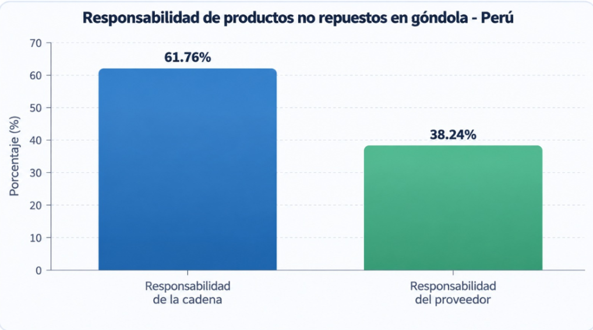
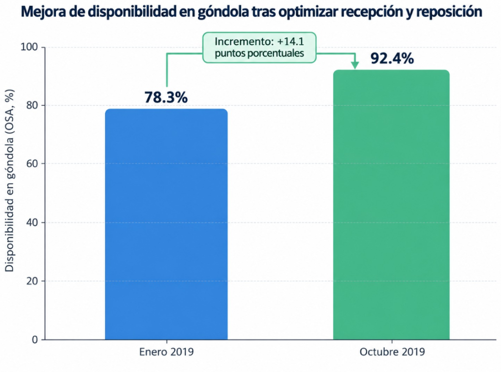
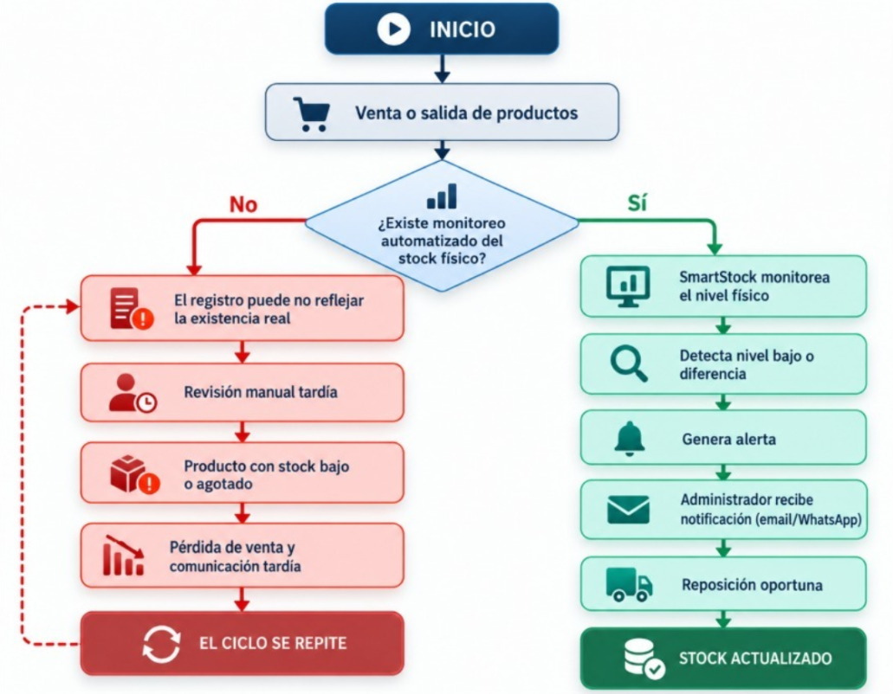
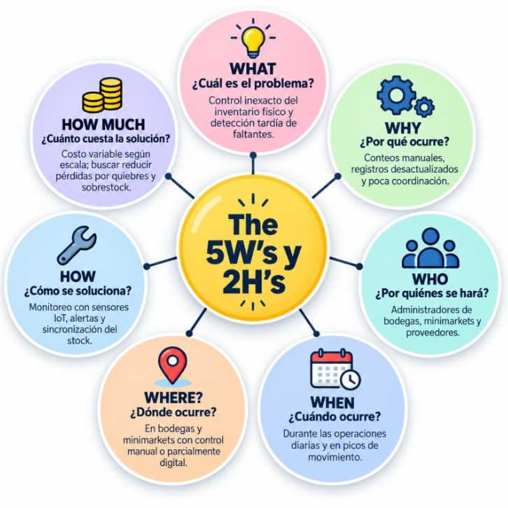
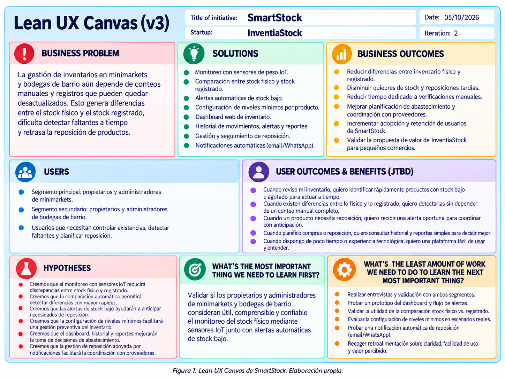

# Capítulo I: Introducción

## 1.1. Startup Profile

Actualmente, muchas bodegas y minimarkets realizan el control de sus productos mediante registros manuales o sistemas que no reflejan de manera inmediata la cantidad física disponible en sus estantes. Esta situación puede generar diferencias entre el inventario registrado y el inventario real, dificultando la identificación de productos agotados o con niveles bajos de stock y afectando la planificación del abastecimiento.

La falta de información actualizada también puede provocar pérdidas de ventas, compras innecesarias, acumulación de productos y dificultades para coordinar oportunamente la reposición con los proveedores. Además, los administradores deben dedicar tiempo a realizar verificaciones manuales para conocer qué productos necesitan ser reabastecidos.

Frente a esta problemática surge **InventiaStock**, una startup orientada al desarrollo de soluciones tecnológicas para mejorar la gestión de inventarios en bodegas y minimarkets mediante tecnologías web e Internet de las Cosas (IoT). Nuestro propósito es facilitar el monitoreo del inventario físico y proporcionar información que permita tomar decisiones de abastecimiento de manera más rápida y organizada.

Como parte de esta propuesta, desarrollamos **SmartStock**, una plataforma web que utiliza sensores de peso conectados a dispositivos IoT para obtener información sobre la cantidad física disponible de determinados productos. El sistema permite comparar estos datos con el stock registrado, detectar diferencias o niveles bajos de inventario y generar alertas para apoyar la reposición de productos.

Además, SmartStock busca mejorar el proceso de reposición mediante alertas automáticas y notificaciones. A partir de las alertas generadas por la plataforma, los propietarios y administradores podrán identificar los productos que requieren abastecimiento y recibir un aviso oportuno (por correo o WhatsApp) para coordinar externamente la reposición con sus proveedores.

---

### 1.1.1. Descripción de la Startup

**InventiaStock** es una startup tecnológica orientada al desarrollo de soluciones digitales para mejorar la gestión de inventarios en bodegas y minimarkets. Nuestra propuesta integra tecnologías web e Internet de las Cosas (IoT) para conectar la información registrada en el sistema con la cantidad física de productos disponible en los establecimientos.

Como parte de esta iniciativa, desarrollamos **SmartStock**, una plataforma web que utiliza sensores de peso conectados a dispositivos IoT para monitorear el inventario en tiempo real. La información obtenida permite comparar el stock físico con el registrado, detectar productos con niveles bajos de existencia, identificar diferencias de inventario y generar alertas para facilitar una reposición oportuna.

Asimismo, la plataforma permite consultar información sobre la rotación de productos, mermas y comportamiento histórico del inventario, apoyando a los administradores en la toma de decisiones. Además, SmartStock incorpora funcionalidades orientadas a facilitar la reposición de productos. Los propietarios y administradores podrán identificar necesidades de abastecimiento mediante las alertas del sistema y recibir notificaciones automáticas (correo electrónico o WhatsApp) que les permitan actuar de manera oportuna frente a sus proveedores.

De esta manera, InventiaStock busca contribuir a una gestión de inventarios más eficiente, reducir pérdidas económicas y mejorar la coordinación entre los pequeños comercios y sus proveedores.

A continuación, se presentan la misión, visión y valores que guían a nuestra startup:

**Tabla 1**

*Misión, visión y valores de InventiaStock*

| Misión | Visión | Valores |
|---|---|---|
| Brindar soluciones tecnológicas que permitan a bodegas y minimarkets gestionar sus inventarios de manera eficiente mediante tecnologías web e IoT, facilitando el monitoreo de productos y el envío de alertas oportunas para su reposición. | Convertirnos en una startup referente en soluciones inteligentes para la gestión de inventarios en pequeños comercios, contribuyendo a su transformación digital, eficiencia operativa y crecimiento sostenible. | **Innovación:** buscamos mejorar continuamente nuestras soluciones tecnológicas.  **Confianza:** brindamos información clara y confiable para la toma de decisiones.  **Eficiencia:** promovemos una mejor gestión de recursos e inventarios.  **Responsabilidad:** desarrollamos soluciones orientadas a las necesidades reales de los usuarios.  **Colaboración:** fomentamos una mejor comunicación entre los comercios y sus proveedores mediante información oportuna. |
Nota. Elaboración propia

---

### 1.1.2. Perfiles de integrantes del equipo

  

  

  

  

  

---

## 1.2. Solution Profile

Nuestra solución, **SmartStock**, es una plataforma web inteligente orientada a mejorar la gestión de inventarios en bodegas y minimarkets mediante el uso de tecnologías web e Internet de las Cosas (IoT). La plataforma utiliza sensores de peso conectados a dispositivos IoT para obtener información sobre la cantidad física disponible de determinados productos y compararla con el stock registrado en el sistema.

A partir de esta información, SmartStock permite detectar productos con niveles bajos de existencia, diferencias entre el inventario físico y el registrado y posibles necesidades de reposición. Asimismo, el sistema genera alertas que permiten a los administradores identificar oportunamente qué productos requieren abastecimiento y consultar información relacionada con la rotación, mermas y comportamiento histórico del inventario para apoyar la toma de decisiones.

Además, la plataforma incorpora funcionalidades orientadas a la gestión de la reposición. Los propietarios y administradores podrán visualizar las necesidades de abastecimiento de los productos, generar alertas ante posibles faltantes y recibir notificaciones automáticas por correo electrónico o WhatsApp que les permitan actuar con anticipación frente a sus proveedores. De esta manera, se busca reducir el tiempo necesario para identificar y atender necesidades de abastecimiento.

El principal valor diferencial de **SmartStock** radica en integrar el monitoreo del inventario físico mediante dispositivos IoT con una plataforma web que centraliza la información y facilita su consulta. A diferencia de los métodos tradicionales basados principalmente en revisiones manuales o registros que pueden no reflejar inmediatamente la cantidad física disponible, SmartStock busca proporcionar información actualizada que contribuya a reducir pérdidas económicas, mejorar la disponibilidad de productos y facilitar una gestión de inventarios más eficiente.

### Alcance de la solución

SmartStock está orientado a apoyar la gestión de inventarios de propietarios y administradores de minimarkets y bodegas de barrio mediante una plataforma web integrada con tecnologías IoT.

El alcance de la solución comprende el registro y gestión de productos, el monitoreo de determinadas existencias físicas mediante sensores de peso, la comparación entre el stock físico y el stock registrado, la configuración de niveles mínimos de stock, la generación de alertas de stock bajo, la consulta del estado general del inventario mediante un dashboard, el acceso a historiales y reportes, y el registro y seguimiento de necesidades de reposición.

Asimismo, SmartStock permitirá el envío de notificaciones mediante servicios externos, como correo electrónico o WhatsApp, para informar oportunamente al usuario sobre eventos relevantes relacionados con el inventario y las necesidades de abastecimiento.

La solución no contempla que SmartStock realice directamente la compra o el pedido al proveedor. Una vez identificada una necesidad de reposición, el propietario o administrador será responsable de coordinar el abastecimiento con el proveedor mediante los canales que utilice habitualmente.

La implementación de los sensores IoT podrá realizarse de manera progresiva, permitiendo que cada establecimiento incorpore dispositivos de acuerdo con la cantidad de productos que requiera monitorear y con las necesidades propias de su operación.

---

### 1.2.1. Antecedentes y problemática

En el contexto de las bodegas y minimarkets, el control de inventarios constituye una actividad crítica para garantizar la disponibilidad de productos, reducir pérdidas y coordinar de manera oportuna el abastecimiento. Sin embargo, en muchos pequeños comercios el seguimiento del stock todavía depende de conteos manuales, registros parciales o verificaciones periódicas que no siempre reflejan con precisión la cantidad física disponible en los estantes o zonas de almacenamiento.

Esta situación puede generar diferencias entre el inventario registrado y el inventario físico, lo que dificulta detectar a tiempo productos con niveles bajos de existencia, faltantes no identificados o reposiciones pendientes. Como consecuencia, los negocios pueden enfrentar quiebres de stock, pérdida de ventas, acumulación innecesaria de mercadería y uso ineficiente del tiempo del personal encargado del control.

Asimismo, la problemática no solo afecta a los administradores de los establecimientos, sino también a los proveedores, ya que una comunicación tardía sobre la falta de stock retrasa la reposición y reduce la capacidad de respuesta ante la demanda. Por ello, el proceso de inventario requiere no solo mayor precisión, sino también una mejor articulación entre los actores involucrados.

A nivel nacional, esta problemática también se refleja en la disponibilidad de productos en el punto de venta. Según Ñaupari et al. (2021), con datos registrados en 2014, el **61.76%** de los productos no repuestos en góndola se relaciona con responsabilidades internas de la cadena, mientras que el **38.24%** corresponde a responsabilidades del proveedor. Esto evidencia que los problemas de disponibilidad no dependen únicamente del abastecimiento externo, sino también de los procesos internos de control y reposición del establecimiento.

Frente a esta necesidad surge **SmartStock**, producto desarrollado por la startup InventiaStock, como una plataforma web inteligente orientada a mejorar la gestión del inventario físico en bodegas y minimarkets mediante sensores de peso conectados a dispositivos IoT. La solución busca comparar automáticamente la cantidad física disponible con el stock registrado, detectar diferencias o niveles bajos de inventario y generar alertas que faciliten la reposición. Estas alertas permitirán a los responsables de minimarkets y bodegas de barrio identificar oportunamente las necesidades de abastecimiento y recibir un aviso a tiempo para gestionar la reposición con sus proveedores.

El análisis de la responsabilidad en la falta de reposición de productos, presentado en el Gráfico 1, permite dimensionar con mayor precisión el origen del problema dentro del sector retail peruano, evidenciando la necesidad de mecanismos de monitoreo interno como el que propone SmartStock.

  

<em>Gráfico 1. Responsabilidad de los productos no repuestos en góndola en el Perú. Fuente: Ñaupari et al. (2021), con datos nacionales de 2014. Elaboración propia.</em>

**Conclusiones a partir del Gráfico 1:**

- El 61.76% de los productos no repuestos en góndola se relaciona con responsabilidades internas de la cadena, mientras que el 38.24% corresponde a responsabilidades del proveedor.
- Esto evidencia que los problemas de disponibilidad no dependen únicamente del abastecimiento externo, sino también de los procesos internos de control y reposición del establecimiento.
- Una mejor coordinación entre los comercios y sus proveedores puede contribuir a reducir los faltantes y mejorar la disponibilidad de productos.

Complementariamente, el siguiente gráfico muestra cómo la mejora de los procesos de recepción y reposición puede incrementar la disponibilidad de productos en góndola, evidenciando la importancia de contar con mecanismos adecuados de control y abastecimiento.

  

<em>Gráfico 2. Evolución de la disponibilidad en góndola (OSA) después de mejorar los procesos de recepción y reposición. Fuente: Ñaupari et al. (2021). Elaboración propia.</em>

**Conclusiones a partir del Gráfico 2:**

- La disponibilidad en góndola aumentó de 78.3% en enero de 2019 a 92.4% en octubre de 2019.
- Esto representa una mejora de 14.1 puntos porcentuales en la disponibilidad de productos.
- Los resultados evidencian que mejorar los procesos de recepción, control y reposición puede reducir los problemas de falta de productos y favorecer una gestión más eficiente del inventario.

En conjunto, ambos gráficos evidencian que los problemas de disponibilidad de productos están relacionados tanto con los procesos internos de los establecimientos como con la participación de los proveedores. Asimismo, se observa que una gestión adecuada de la recepción y reposición puede mejorar significativamente la disponibilidad en góndola. Desde una perspectiva causal, el siguiente Diagrama de Ishikawa sintetiza las principales causas de la problemática.

  

<em>Gráfico 3. Diagrama de Ishikawa sobre las causas de la gestión ineficiente del inventario en bodegas y minimarkets. (2026). Elaboración propia.</em>

**Conclusiones a partir del Gráfico 3:**

- La problemática del inventario es multifactorial, ya que intervienen factores tecnológicos, operativos, humanos, de coordinación con proveedores y de comportamiento de la demanda.
- La dimensión tecnológica resulta crítica, debido a que la ausencia de monitoreo físico automatizado y de integración entre datos limita la visibilidad del inventario real.
- La coordinación con proveedores constituye un factor relevante, puesto que una detección tardía de faltantes también retrasa el proceso de reposición y afecta la disponibilidad de productos.

El flujo del problema puede describirse de la siguiente manera: durante la operación diaria se producen ventas y salidas de productos, pero si no existe un mecanismo de monitoreo automático del stock físico, las diferencias entre lo registrado y lo realmente disponible pueden pasar desapercibidas. Esto lleva a revisiones tardías, quiebres de stock y una reposición demorada. El siguiente diagrama resume este ciclo e indica el punto en el que SmartStock interviene.

  

<em>Gráfico 4. Diagrama de flujo sobre el ciclo de detección tardía y reposición del inventario en bodegas y minimarkets. (2026). Elaboración propia.</em>

**Conclusiones a partir del Gráfico 4:**

- Sin un sistema de monitoreo automatizado, el negocio entra en un ciclo repetitivo de desactualización del inventario, revisión tardía y reposición reactiva.
- SmartStock actúa como punto de quiebre al detectar niveles bajos de stock o diferencias entre el inventario físico y el registrado antes de que se produzca una afectación mayor.
- La generación de alertas y la visibilidad compartida con administradores y proveedores permiten transformar un proceso reactivo en uno preventivo y mejor coordinado.

#### The 5W's and 2H's

**1. What - ¿Cuál es el problema?**

El problema consiste en la dificultad de bodegas y minimarkets para mantener actualizado el control de su inventario físico, lo que puede generar diferencias con el stock registrado y provocar que los productos con niveles bajos o agotados sean identificados de manera tardía.

**2. When - ¿Cuándo ocurre?**

La problemática se presenta durante las operaciones diarias del establecimiento, especialmente cuando se realizan ventas, recepción de mercadería, reposiciones o movimientos frecuentes que modifican continuamente las existencias disponibles.

**3. Where - ¿Dónde ocurre?**

Se presenta principalmente en bodegas y minimarkets donde el control del inventario físico depende de verificaciones manuales o de sistemas que no están conectados directamente con las existencias reales en estantes o zonas de almacenamiento.

**4. Who - ¿Quiénes están involucrados?**

Los principales involucrados son los propietarios o administradores de bodegas y minimarkets, encargados del control y reposición del inventario, así como los proveedores responsables de abastecer los productos comercializados por estos establecimientos.

**5. Why - ¿Por qué ocurre?**

Ocurre debido a la dependencia de conteos manuales, errores durante el registro de movimientos, falta de sincronización entre inventario físico y digital, variaciones en la demanda y una comunicación que puede darse tardíamente entre comercios y proveedores.

**6. How - ¿Cómo se puede solucionar?**

La solución propuesta, SmartStock, plantea utilizar sensores de peso conectados a dispositivos IoT para monitorear las existencias físicas de determinados productos. La plataforma web procesa estos datos para compararlos con el inventario registrado, detectar niveles bajos de stock, generar alertas y facilitar la coordinación de reposición.

**7. How much - ¿Cuánto impacto genera / cuánto cuesta la solución?**

La falta de un control adecuado del inventario puede generar pérdidas por quiebres de stock, compras innecesarias, exceso de existencias y tiempo empleado en verificaciones manuales. En cuanto a la solución, el costo dependerá de la escala de implementación, cantidad de sensores y alcance del servicio; sin embargo, su propósito es reducir costos operativos y mejorar la disponibilidad de productos.

  

<em>Gráfico 5. Equipo InventiaStock. The 5 W's y 2H's sobre la problemática de la gestión de inventarios en bodegas y minimarkets. (2026). Elaboración propia.</em>

---

### 1.2.2. Lean UX Process

### 1.2.2.1. Lean UX Problem Statements

Actualmente, la gestión de inventarios en **minimarkets y bodegas de barrio** depende en gran medida de conteos manuales, registros realizados por los administradores y verificaciones periódicas de los productos disponibles. Esta forma de trabajo puede generar diferencias entre el inventario registrado y el inventario físico, dificultando la detección oportuna de productos con niveles bajos de stock o agotados.

Asimismo, los propietarios y administradores necesitan conocer constantemente qué productos requieren reposición para mantener una adecuada disponibilidad de mercadería. Sin embargo, cuando la información del inventario no se encuentra actualizada, la identificación de faltantes puede realizarse de manera tardía, generando quiebres de stock, pérdida de oportunidades de venta y mayor tiempo dedicado a verificaciones manuales.

#### Propósito

**InventiaStock** busca mejorar la gestión de inventarios de pequeños comercios mediante el desarrollo de soluciones tecnológicas orientadas al monitoreo y control de existencias. Como parte de esta propuesta, su producto **SmartStock** integra una plataforma web con sensores de peso conectados mediante tecnologías IoT, permitiendo monitorear las existencias físicas de determinados productos, compararlas con el stock registrado y generar alertas ante niveles bajos o diferencias de inventario.

El propósito de SmartStock es facilitar a los propietarios y administradores una gestión más oportuna del inventario, reducir la dependencia de verificaciones manuales y proporcionar información que permita mejorar la planificación de la reposición y la coordinación con los proveedores.

#### Mercado

El mercado objetivo está conformado por **propietarios y administradores de minimarkets y bodegas de barrio** que requieren mejorar el control de sus existencias y la reposición de productos.

Dentro del mercado objetivo, los **minimarkets** constituyen el segmento principal debido al mayor volumen de productos y movimientos de inventario. Asimismo, las **bodegas de barrio** representan un segmento relevante con necesidades similares de control y reposición, aunque pueden operar a una menor escala y con procesos de gestión más simples.

#### Oportunidad

Existe una oportunidad para ofrecer una solución accesible y adaptada a pequeños establecimientos comerciales que permita automatizar parcialmente el monitoreo del inventario físico.

Las diferencias entre el inventario registrado y el inventario real pueden ocasionar productos agotados, quiebres de stock, compras innecesarias, acumulación de mercadería y pérdida de oportunidades de venta. Además, algunas soluciones de gestión de inventarios se concentran principalmente en registrar entradas y salidas de productos, sin incorporar necesariamente mecanismos automáticos para conocer la cantidad física disponible en tiempo real.

Asimismo, algunas soluciones tecnológicas existentes están orientadas a operaciones de retail de mayor escala, lo que puede dificultar su adopción en pequeños establecimientos debido a su complejidad o costos de implementación. Frente a ello, SmartStock representa una oportunidad para atender este segmento mediante una solución basada en IoT que facilite el monitoreo del stock físico y apoye la toma de decisiones de abastecimiento.

Consideraremos que la solución es exitosa cuando los usuarios de ambos segmentos puedan detectar con mayor rapidez productos con bajo stock, identificar diferencias entre el inventario físico y el registrado, reducir el tiempo dedicado a verificaciones manuales y mejorar la planificación de la reposición de productos.

De acuerdo con lo anterior, planteamos el siguiente **Problem Statement**:

> **¿De qué manera podríamos mejorar la gestión de inventarios en minimarkets y bodegas de barrio para que sus propietarios y administradores puedan conocer oportunamente los niveles reales de stock, detectar faltantes y diferencias de inventario, y gestionar la reposición de productos mediante una solución automatizada basada en tecnologías IoT?**

---

#### 1.2.2.2. Lean UX Assumptions

Para abordar la problemática relacionada con la gestión de inventarios en minimarkets y bodegas de barrio, se han definido una serie de supuestos que orientan el desarrollo y validación de **SmartStock**, producto desarrollado por **InventiaStock**. Estos supuestos consideran las necesidades de los segmentos objetivo, los resultados esperados del negocio, los beneficios para los usuarios, las funcionalidades propuestas y los criterios que permitirán evaluar posteriormente si la solución responde adecuadamente al problema identificado.

##### Business Assumptions

- Creemos que los minimarkets necesitan mejorar el control de su inventario físico debido al volumen de productos y movimientos que gestionan diariamente.
- Suponemos que los propietarios y administradores de minimarkets valorarán una solución que reduzca el tiempo dedicado a conteos y verificaciones manuales.
- Creemos que las bodegas de barrio también presentan dificultades para mantener actualizado su inventario y requieren una solución sencilla y de bajo esfuerzo operativo.
- Suponemos que los minimarkets constituirán inicialmente el segmento principal de SmartStock debido a su mayor volumen de operaciones y necesidad de control continuo del inventario.
- Creemos que las bodegas de barrio representan también un segmento relevante, aunque pueden presentar una mayor sensibilidad al costo de adopción y una menor escala operativa.
- Suponemos que un modelo de suscripción escalable, acompañado de una implementación gradual de sensores, puede adaptarse a las posibilidades de ambos segmentos.
- Creemos que los usuarios estarán dispuestos a adoptar SmartStock si perciben una reducción en el esfuerzo requerido para controlar el inventario y organizar la reposición de productos.

##### Business Outcome Assumptions

- Creemos que SmartStock permitirá reducir las diferencias entre el inventario físico y el inventario registrado.
- Suponemos que las alertas de stock bajo permitirán disminuir los casos en los que un producto se agota sin ser detectado oportunamente.
- Creemos que la plataforma permitirá reducir el tiempo destinado a verificaciones manuales del inventario.
- Suponemos que la información generada por SmartStock facilitará una reposición más oportuna de productos.
- Creemos que una interfaz sencilla favorecerá la adopción de SmartStock por parte de propietarios y administradores de minimarkets y bodegas de barrio.
- Suponemos que una propuesta escalable permitirá implementar inicialmente la solución en minimarkets y ampliar posteriormente su adopción en bodegas de barrio.
- Creemos que una mejor disponibilidad de información sobre el inventario puede contribuir a reducir compras innecesarias y mejorar la planificación del abastecimiento.

##### User Assumptions

- Creemos que uno de los principales grupos de usuarios estará conformado por propietarios y administradores de minimarkets responsables del control de inventario y la reposición.
- Suponemos que otro grupo importante estará conformado por propietarios y administradores de bodegas de barrio que realizan directamente el control de sus productos.
- Creemos que los responsables de minimarkets necesitan visualizar rápidamente el estado de un inventario con una mayor cantidad de productos y movimientos.
- Suponemos que los responsables de bodegas de barrio necesitan una solución simple, fácil de aprender y que no incremente significativamente su carga operativa.
- Creemos que ambos grupos necesitan información clara y actualizada para identificar productos con bajo stock y posibles diferencias de inventario.
- Suponemos que los usuarios pueden presentar distintos niveles de experiencia tecnológica, por lo que la plataforma debe ser intuitiva, accesible y fácil de utilizar.
- Creemos que los usuarios valorarán especialmente las funcionalidades que les permitan anticipar necesidades de reposición y reducir verificaciones manuales.

##### User Outcome and Benefit Assumptions

- Creemos que los responsables de minimarkets podrán identificar con mayor rapidez los productos que requieren reposición.
- Suponemos que los responsables de bodegas de barrio podrán reducir el tiempo empleado en conteos y verificaciones manuales.
- Creemos que ambos segmentos podrán detectar con mayor facilidad diferencias entre las existencias físicas y las registradas.
- Suponemos que los usuarios podrán tomar decisiones de reposición utilizando información más actualizada.
- Creemos que las alertas permitirán anticipar faltantes antes de que determinados productos se agoten.
- Suponemos que los reportes y la información histórica ayudarán a comprender mejor la rotación y el comportamiento del inventario.
- Creemos que los usuarios tendrán una mejor visión del estado general de sus existencias mediante un dashboard centralizado.
- Suponemos que una mejor visualización de la información facilitará la coordinación de las necesidades de abastecimiento con los proveedores.

##### Feature Assumptions

- Creemos que el monitoreo mediante sensores de peso IoT permitirá obtener información sobre las existencias físicas de determinados productos.
- Creemos que la comparación automática entre el stock físico y el stock registrado permitirá identificar diferencias de inventario.
- Creemos que las alertas automáticas de stock bajo ayudarán a detectar oportunamente necesidades de reposición.
- Suponemos que la configuración de niveles mínimos de stock permitirá adaptar las alertas a las necesidades de cada establecimiento.
- Creemos que un dashboard de inventario facilitará la visualización del estado general de los productos.
- Suponemos que el historial de alertas, movimientos y reportes de rotación permitirá realizar un mejor seguimiento del inventario.
- Creemos que una función de gestión de reposición permitirá registrar necesidades de abastecimiento y facilitar la coordinación posterior con los proveedores.
- Suponemos que las notificaciones automáticas por correo electrónico o WhatsApp, mediante servicios externos, permitirán informar oportunamente sobre productos que requieran atención.
- Creemos que la posibilidad de editar información de los productos y sus niveles mínimos permitirá mantener actualizado el catálogo y adaptar el sistema a las necesidades de cada negocio.

##### Objetivos de Validación

A partir de los supuestos planteados, se establecen los siguientes objetivos de validación para SmartStock:

- Determinar si los usuarios comprenden con facilidad la información presentada sobre el estado de su inventario.
- Evaluar si los usuarios pueden identificar productos con bajo stock de manera rápida y sencilla.
- Comprobar si la comparación entre el inventario físico y el inventario registrado facilita la identificación de diferencias.
- Evaluar si las alertas permiten reconocer oportunamente necesidades de reposición.
- Determinar si los usuarios pueden configurar correctamente niveles mínimos de stock.
- Evaluar si el dashboard y el historial permiten realizar un seguimiento adecuado del inventario.
- Identificar si SmartStock contribuye a reducir el tiempo dedicado a verificaciones manuales.
- Evaluar la facilidad de uso y comprensión de las principales funcionalidades de la plataforma.
- Obtener evidencia que permita validar o rechazar los principales supuestos de negocio, usuario y funcionalidades.

##### Métricas

Para evaluar los supuestos y objetivos planteados se considerarán las siguientes métricas:

- Porcentaje de usuarios que logran identificar correctamente productos con bajo stock.
- Tiempo promedio requerido para localizar un producto que necesita reposición.
- Porcentaje de diferencias detectadas correctamente entre el inventario físico y el inventario registrado.
- Tiempo promedio dedicado a verificaciones manuales antes y después del uso de SmartStock.
- Número de alertas de stock bajo generadas y atendidas oportunamente.
- Porcentaje de usuarios que logran configurar correctamente un nivel mínimo de stock.
- Porcentaje de usuarios que completan las principales tareas de gestión de inventario sin asistencia.
- Número de errores cometidos durante la ejecución de tareas principales.
- Nivel de satisfacción de los usuarios respecto a la facilidad de uso de la plataforma.
- Porcentaje de usuarios que consideran útil la información mostrada en el dashboard.
- Frecuencia de consulta del historial de movimientos, alertas o reportes.
- Porcentaje de usuarios que manifiestan que SmartStock facilita la planificación de la reposición.

##### Definition of Done (DoD)

Los supuestos planteados se considerarán suficientemente validados cuando se obtenga evidencia de que SmartStock permite a los usuarios objetivo realizar las principales actividades de gestión de inventario de manera comprensible y funcional.

Para este propósito, se considerará como **Definition of Done** el cumplimiento de los siguientes criterios:

- Los propietarios y administradores pueden visualizar el estado actual de los productos registrados en la plataforma.
- El sistema permite registrar, consultar y actualizar la información principal de los productos.
- Los usuarios pueden configurar niveles mínimos de stock.
- El sistema permite visualizar información relacionada con las existencias físicas de los productos monitoreados.
- La plataforma permite comparar el stock físico con el stock registrado.
- El sistema genera alertas cuando se detectan niveles bajos de stock de acuerdo con los valores configurados.
- Los usuarios pueden identificar qué productos requieren reposición a partir de la información mostrada en SmartStock.
- El dashboard presenta información comprensible sobre el estado general del inventario.
- Los usuarios pueden consultar información histórica relacionada con movimientos, alertas o comportamiento del inventario.
- Las principales funcionalidades pueden ser utilizadas por los usuarios objetivo sin requerir conocimientos técnicos especializados.
- Las pruebas realizadas con usuarios permiten recopilar evidencia suficiente para validar o rechazar los principales supuestos de negocio, usuario y funcionalidades.

---

#### 1.2.2.3. Lean UX Hypothesis Statements

De acuerdo con los supuestos definidos previamente, se plantean las siguientes hipótesis con el propósito de validar si las funcionalidades propuestas de **SmartStock**, producto desarrollado por **InventiaStock**, generan beneficios para los propietarios y administradores de minimarkets y bodegas de barrio.

Las hipótesis han sido formuladas tomando como referencia los Business Assumptions, User Assumptions, User Outcome and Benefit Assumptions y Feature Assumptions definidos previamente. Para su formulación se utilizará el siguiente template de Lean UX:

> **Creemos que [resultado esperado] para [usuario o segmento] se logrará mediante [funcionalidad o solución]. Sabremos que nuestra hipótesis es válida cuando [resultado medible].**

A continuación, se plantean los Hypothesis Statements correspondientes a las principales funcionalidades y resultados esperados de SmartStock.

##### Hipótesis de negocio

1. **Monitoreo del inventario físico mediante sensores IoT**

   Creemos que **reducir las diferencias entre el inventario físico y el inventario registrado** para los propietarios y administradores de minimarkets y bodegas de barrio se logrará mediante el monitoreo de determinados productos utilizando sensores de peso conectados mediante tecnologías IoT.

   **Sabremos que nuestra hipótesis es válida cuando al menos el 80 % de los productos monitoreados presente información consistente entre las existencias físicas detectadas por los sensores y las registradas en la plataforma durante las pruebas de validación.**

2. **Comparación entre stock físico y stock registrado**

   Creemos que **identificar con mayor rapidez las diferencias de inventario** para los propietarios y administradores se logrará mediante una funcionalidad que permita comparar la información del stock físico con el stock registrado en SmartStock.

   **Sabremos que nuestra hipótesis es válida cuando al menos el 75 % de los usuarios logre identificar correctamente una diferencia de inventario mediante la plataforma sin necesidad de realizar previamente un conteo manual completo.**

3. **Alertas automáticas de stock bajo**

   Creemos que **anticipar las necesidades de reposición antes de que un producto se agote** para los propietarios y administradores se logrará mediante alertas automáticas de stock bajo.

   **Sabremos que nuestra hipótesis es válida cuando al menos el 80 % de los usuarios considere que las alertas le permiten identificar oportunamente productos que requieren reposición antes de alcanzar un nivel de agotamiento.**

4. **Configuración de niveles mínimos de stock**

   Creemos que **mejorar la planificación preventiva de la reposición** para los propietarios y administradores se logrará permitiendo configurar niveles mínimos de stock de acuerdo con las necesidades de cada establecimiento.

   **Sabremos que nuestra hipótesis es válida cuando al menos el 75 % de los usuarios logre configurar correctamente los niveles mínimos de sus productos y utilizar las alertas asociadas para determinar cuáles requieren reposición.**

5. **Gestión de necesidades de reposición**

   Creemos que **organizar de manera más eficiente las necesidades de abastecimiento** para los propietarios y administradores se logrará mediante una funcionalidad que permita registrar, consultar y dar seguimiento a las necesidades de reposición.

   **Sabremos que nuestra hipótesis es válida cuando al menos el 75 % de los usuarios logre identificar un producto que requiere reposición, registrar la necesidad de abastecimiento y consultar posteriormente su estado dentro de SmartStock.**

##### Hipótesis de usuario

6. **Dashboard de inventario**

   Creemos que **consultar con mayor rapidez el estado general del inventario** para los propietarios y administradores de minimarkets y bodegas de barrio se logrará mediante un dashboard que presente información clara sobre los productos registrados.

   **Sabremos que nuestra hipótesis es válida cuando al menos el 85 % de los usuarios logre identificar correctamente productos con stock suficiente, stock bajo o agotado desde el dashboard sin requerir asistencia.**

7. **Historial de movimientos, alertas y reportes**

   Creemos que **comprender mejor el comportamiento del inventario y apoyar la toma de decisiones de reposición** para los propietarios y administradores se logrará mediante el acceso a información histórica de movimientos, alertas y reportes.

   **Sabremos que nuestra hipótesis es válida cuando al menos el 70 % de los usuarios considere que la información histórica presentada por SmartStock resulta útil para analizar el comportamiento de sus productos y planificar su abastecimiento.**

8. **Notificaciones automáticas**

   Creemos que **informar oportunamente sobre eventos relevantes del inventario** para los propietarios y administradores se logrará mediante notificaciones automáticas enviadas por correo electrónico o WhatsApp utilizando servicios externos.

   **Sabremos que nuestra hipótesis es válida cuando al menos el 75 % de los usuarios identifique correctamente una alerta recibida, comprenda el motivo de la notificación y determine la acción correspondiente sin necesidad de ingresar previamente al sistema para detectar el problema.**

9. **Gestión y actualización de productos**

   Creemos que **mantener información confiable y actualizada del catálogo** para los propietarios y administradores se logrará mediante funcionalidades que permitan registrar y editar la información de los productos y sus parámetros de inventario.

   **Sabremos que nuestra hipótesis es válida cuando al menos el 80 % de los usuarios logre registrar o modificar correctamente la información de un producto, incluyendo sus datos principales y nivel mínimo de stock, sin requerir asistencia.**

##### Criterio general de validación

Las hipótesis serán evaluadas mediante pruebas con usuarios pertenecientes a los segmentos objetivo, considerando las métricas definidas previamente para SmartStock. Los resultados permitirán determinar qué supuestos pueden considerarse validados, cuáles requieren ajustes y qué funcionalidades deben ser mejoradas antes de continuar con las siguientes etapas de desarrollo del producto.

---

#### 1.2.2.4. Lean UX Canvas

  

<em>Figura 1. Lean UX Canvas de SmartStock. Elaboración propia.</em>

---

## 1.3. Segmentos objetivo

### Propietarios y administradores de minimarkets

Son personas responsables de gestionar las operaciones diarias de minimarkets, incluyendo el control del inventario, revisión de existencias, reposición de productos y coordinación del abastecimiento. Debido al mayor volumen de productos y movimientos que suelen manejar estos establecimientos, necesitan identificar con rapidez diferencias entre el stock registrado y las existencias físicas.

Para el proyecto, este segmento se prioriza como principal por su volumen de operación y por una mayor capacidad de pago mensual esperada para adoptar una solución tecnológica de monitoreo de inventario. Buscan contar con información actualizada que facilite la reposición, reduzca los quiebres de stock y disminuya el tiempo dedicado a verificaciones manuales.

Los hallazgos obtenidos durante las entrevistas muestran que este segmento presenta preocupación por las diferencias entre el stock registrado y las cantidades disponibles físicamente, especialmente en productos de alta rotación. Asimismo, las revisiones y conteos manuales representan una fuente de esfuerzo y posibles errores. Por ello, valoran una solución sencilla, clara y organizada que les permita conocer rápidamente las unidades disponibles, identificar productos próximos a agotarse y recibir alertas cuando se alcance un nivel mínimo de stock.

Como contexto empresarial, PRODUCE reporta que en 2024 existían **2 331 173 Mipyme formales en el Perú**, equivalentes al **99,3 % de las empresas formales operativas**. Este dato permite dimensionar la importancia de las micro y pequeñas empresas dentro de la actividad empresarial nacional.

**Fuente:**  
https://drive.google.com/file/d/1cA56NNQ19692vqOC5qiFTh7LyHq6A3dG/view?usp=sharing

### Propietarios y administradores de bodegas de barrio

Son personas responsables de gestionar las operaciones diarias de bodegas de barrio, incluyendo el control de productos, revisión de existencias y reposición. Este segmento se considera secundario debido a que, aunque representa un mercado amplio para la solución, se espera una menor capacidad de pago mensual y una mayor sensibilidad al costo de implementación.

En muchos casos, el control de inventario depende de conteos manuales, inspecciones visuales, cuadernos o registros simples, lo que puede generar diferencias entre el stock registrado y el real y dificultar la identificación oportuna de productos agotados o próximos a agotarse.

Los resultados obtenidos durante las entrevistas muestran que los responsables de bodegas de barrio necesitan conocer rápidamente qué productos están disponibles, cuáles presentan niveles bajos de stock y cuáles requieren reabastecimiento. Asimismo, prefieren una herramienta sencilla, rápida y fácil de aprender que permita reducir el tiempo empleado en revisiones manuales y evitar pérdidas ocasionadas por la falta de productos de alta demanda.

Este segmento también valora la posibilidad de recibir alertas automáticas cuando un producto se encuentra próximo a agotarse y considera importante que la solución mantenga un costo accesible acorde con las características y escala de una pequeña bodega.

Como contexto del sector comercial, el INEI señala que en Lima Metropolitana y Callao, durante el cuarto trimestre de 2024, el **42,6 % de las nuevas empresas registradas correspondió a comercio y reparación de vehículos**, lo que evidencia la relevancia de las actividades comerciales dentro de la dinámica empresarial.

**Fuente:**  
https://www.gob.pe/institucion/inei/informes-publicaciones/6550169-demografia-empresarial-en-el-peru-iv-trimestre-2024

### Relación con los User Personas

A partir de estos dos segmentos objetivo se desarrollaron los **User Personas** del proyecto, utilizando como base los hallazgos obtenidos durante las entrevistas a propietarios y administradores de minimarkets y bodegas de barrio.

Estos perfiles permiten representar de manera más concreta sus necesidades, frustraciones, comportamientos, expectativas y nivel de familiaridad con herramientas tecnológicas. Asimismo, sirven como base para la elaboración de los **User Journey Maps**, User Task Matrix, Empathy Maps y demás artefactos de Needfinding.

De esta manera, las decisiones de diseño y desarrollo de SmartStock buscan mantenerse alineadas con las características reales de ambos segmentos, priorizando una experiencia de uso sencilla, información clara sobre el inventario, alertas oportunas y mecanismos que faciliten la planificación de la reposición.
