# Capítulo II: Requirements Elicitation & Analysis

## 2.1. Competidores

- **Trax Retail :**

Trax Retail es una solución tecnológica orientada al análisis y monitoreo de productos en tiendas mediante visión por computadora e inteligencia artificial. Su plataforma permite digitalizar los estantes, identificar productos, verificar su ubicación y analizar información relacionada con disponibilidad, cumplimiento y desempeño de los SKU. Además, genera métricas y reportes que ayudan a mejorar la gestión del inventario y las decisiones dentro del establecimiento. A diferencia de SmartStock, Trax se basa principalmente en reconocimiento de imágenes e inteligencia artificial, mientras que SmartStock propone utilizar sensores de peso IoT y enfocarse en bodegas y minimarkets.

- **Trigo Retail :**

Trigo Retail desarrolla soluciones basadas en visión por computadora e inteligencia artificial para modernizar las operaciones de tiendas físicas. Su tecnología permite obtener información en tiempo real sobre las actividades dentro del establecimiento y generar datos que apoyan la gestión operativa y la toma de decisiones. Trigo está orientado a soluciones avanzadas de retail y tiendas inteligentes, mientras que SmartStock busca una alternativa más sencilla para pequeños comercios mediante sensores IoT, alertas de inventario y coordinación con proveedores.

- **Pensa Systems :**

Pensa Systems es una solución especializada en digitalizar el inventario disponible en los estantes mediante inteligencia artificial y visión computacional. Su tecnología permite identificar la disponibilidad real de productos, detectar productos agotados, conocer su ubicación y mejorar la precisión del inventario. Al igual que SmartStock, busca proporcionar mayor visibilidad sobre las existencias físicas; sin embargo, Pensa utiliza principalmente análisis visual mediante IA, mientras que SmartStock propone sensores de peso IoT y funcionalidades dirigidas específicamente a la relación entre bodegas, minimarkets y proveedores.

### 2.1.1. Análisis competitivo

**Competitive Analysis Landscape**

**¿Por qué llevar a cabo este análisis?**

Permite identificar cómo funcionan las soluciones actuales de gestión de inventarios, reconocer sus limitaciones y diferenciar a SmartStock mediante el monitoreo con sensores IoT, alertas de stock y una mejor coordinación con proveedores.

**Logos**

<table border="1" cellspacing="0" cellpadding="8">
  <thead>
    <tr>
      <th>SmartStock</th>
      <th>Trax Retail</th>
      <th>Trigo Retail</th>
      <th>Pensa Systems</th>
    </tr>
  </thead>
  <tbody>
    <tr>
      <td align="center">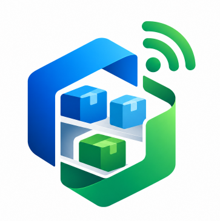</td>
      <td align="center">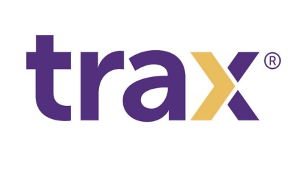</td>
      <td align="center"></td>
      <td align="center"></td>
    </tr>
  </tbody>
</table>

**Perfil**

<table border="1" cellspacing="0" cellpadding="8">
  <thead>
    <tr>
      <th></th>
      <th>SmartStock</th>
      <th>Trax Retail</th>
      <th>Trigo Retail</th>
      <th>Pensa Systems</th>
    </tr>
  </thead>
  <tbody>
    <tr>
      <td><strong>Overview</strong></td>
      <td>SmartStock es una plataforma web orientada a bodegas y minimarkets que utiliza sensores de peso IoT para monitorear el inventario físico, compararlo con el stock registrado y generar alertas ante faltantes o niveles bajos. Además, incorpora funcionalidades para facilitar la coordinación con proveedores.</td>
      <td>Trax Retail ofrece soluciones de reconocimiento de imágenes, visión computacional e inteligencia artificial para analizar productos en tiendas. Permite obtener información sobre disponibilidad en estantes, ubicación de productos, cumplimiento de planogramas, precios y promociones.</td>
      <td>Trigo Retail desarrolla soluciones para tiendas físicas mediante Computer Vision AI. Su tecnología utiliza cámaras e infraestructura de visión computacional para reconocer productos y actividades dentro de la tienda y proporcionar información operacional en tiempo real.</td>
      <td>Pensa Systems utiliza Vision AI para digitalizar los estantes de tiendas físicas. Su tecnología identifica productos, disponibilidad, ubicación, stockouts y condiciones del estante, convirtiendo esta información en acciones y análisis para retailers y marcas</td>
    </tr>
    <tr>
      <td><strong>Ventaja competitiva ¿Qué valor ofrece a los clientes?</strong></td>
      <td>
        • Monitoreo mediante sensores de peso IoT. 
        • Alertas de stock bajo. 
        • Comparación entre inventario físico y registrado. 
        • Gestión de reposición mediante alertas y notificaciones automáticas 
        • Enfoque específico en bodegas y minimarkets.
      </td>
      <td>
        • Reconocimiento de productos mediante IA. 
        • Información sobre disponibilidad, distribución, precios y promociones. 
        • Analítica avanzada para la ejecución comercial. 
        • Experiencia con grandes marcas y cadenas de retail.
      </td>
      <td>
        • Computer Vision AI. 
        • Puede aprovechar infraestructura CCTV existente. 
        • Procesamiento en tiempo real. 
        • Alta escalabilidad y adaptación a operaciones de retail.
      </td>
      <td>
        • Digitalización del estante físico. 
        • Detección de stockouts. 
        • Análisis de ubicación y surtido. 
        • Información accionable para corregir problemas de disponibilidad.
      </td>
    </tr>
  </tbody>
</table>

**Perfil de marketing**

<table border="1" cellspacing="0" cellpadding="8">
  <thead>
    <tr>
      <th></th>
      <th>SmartStock</th>
      <th>Trax Retail</th>
      <th>Trigo Retail</th>
      <th>Pensa Systems</th>
    </tr>
  </thead>
  <tbody>
    <tr>
      <td><strong>Mercado Objetivo</strong></td>
      <td>Propietarios y administradores de minimarkets como segmento principal y propietarios y administradores de bodegas de barrio como segmento secundario. Ambos requieren mejorar el control del inventario físico y detectar oportunamente productos con bajo stock.</td>
      <td>Empresas de productos de consumo masivo, retailers, supermercados, tiendas de conveniencia y equipos encargados de ejecución comercial.</td>
      <td>Retailers y cadenas de tiendas físicas interesadas en automatización, inteligencia operacional, prevención de pérdidas y soluciones de retail autónomo.</td>
      <td>Retailers, empresas de productos de consumo masivo y marcas que necesitan conocer con mayor precisión la disponibilidad y ejecución de sus productos en estantes.</td>
    </tr>
    <tr>
      <td><strong>Estrategias de Marketing</strong></td>
      <td>
        • Marketing digital mediante redes sociales y contenido sobre gestión de inventarios. 
        • Demostraciones del producto. 
        • Pruebas piloto en establecimientos. 
        • Alianzas con proveedores y distribuidores. 
        • Modelo de suscripción adaptable al tamaño del negocio.
      </td>
      <td>
        • Marketing B2B. 
        • Casos de éxito. 
        • Demostraciones y contacto comercial. 
        • Contenido especializado sobre retail, IA y disponibilidad de productos.
      </td>
      <td>
        • Alianzas estratégicas. 
        • Venta empresarial. 
        • Ecosistemas tecnológicos y cloud. 
        • Posicionamiento en innovación aplicada al retail.
      </td>
      <td>
        • Demostraciones comerciales. 
        • Casos de estudio, webinars y recursos especializados. 
        • Marketing B2B para retailers y empresas CPG. 
        • Alianzas tecnológicas
      </td>
    </tr>
  </tbody>
</table>

**Perfil de producto**

<table border="1" cellspacing="0" cellpadding="8">
  <thead>
    <tr>
      <th></th>
      <th>SmartStock</th>
      <th>Trax Retail</th>
      <th>Trigo Retail</th>
      <th>Pensa Systems</th>
    </tr>
  </thead>
  <tbody>
    <tr>
      <td><strong>Productos y Servicios</strong></td>
      <td>Plataforma web para monitorear inventarios mediante sensores de peso IoT. Incluye niveles de stock, comparación entre inventario físico y registrado, alertas, historial de movimientos, reportes de rotación y mermas, y funcionalidades para gestionar la reposición y coordinar pedidos con proveedores externos.</td>
      <td>Plataforma de reconocimiento de imágenes e inteligencia de retail para analizar disponibilidad, ubicación de SKU, precios, promociones, cumplimiento de exhibiciones y otros indicadores de ejecución comercial.</td>
      <td>Soluciones de Computer Vision AI para retail, incluyendo inteligencia operacional, prevención de pérdidas y retail autónomo. Analiza imágenes de cámaras para identificar productos y actividades dentro de las tiendas.</td>
      <td>Soluciones de Vision AI orientadas a Shelf Intelligence. Permite identificar disponibilidad, stockouts, ubicación, surtido, cumplimiento de planogramas y condiciones físicas del estante.</td>
    </tr>
    <tr>
      <td><strong>Precios y costos</strong></td>
      <td>Se plantea un modelo de suscripción cuyos planes podrán variar según la cantidad de productos, sensores y funcionalidades contratadas. También debe considerarse el costo inicial de los dispositivos IoT.</td>
      <td>No presenta precios públicos estandarizados. El servicio se comercializa mediante contacto y reuniones con clientes empresariales.</td>
      <td>No presenta un tarifario público; la solución se adapta a la infraestructura y necesidades de cada retailer.</td>
      <td>No publica precios estandarizados. Los clientes pueden solicitar una demostración y contactar directamente con el equipo comercial.</td>
    </tr>
    <tr>
      <td><strong>Canales de distribución (Web y/o móvil)</strong></td>
      <td>
        Web: plataforma principal para propietarios y administradores de minimarkets y bodegas de barrio.  
        IoT: sensores instalados físicamente en los establecimientos.
      </td>
      <td>Web/Cloud y móvil: plataforma, dashboards y aplicaciones utilizadas por personal de campo y administradores.</td>
      <td>Plataforma empresarial: integración con infraestructura de tiendas, cámaras CCTV y sistemas de procesamiento; también puede operar mediante ecosistemas cloud.</td>
      <td>Web/Plataforma: dashboards y herramientas de análisis conectados a su sistema de captura y Vision AI.</td>
    </tr>
  </tbody>
</table>

**Análisis SWOT**

<table border="1" cellspacing="0" cellpadding="8">
  <thead>
    <tr>
      <th></th>
      <th>SmartStock</th>
      <th>Trax Retail</th>
      <th>Trigo Retail</th>
      <th>Pensa Systems</th>
    </tr>
  </thead>
  <tbody>
    <tr>
      <td><strong>Fortalezas</strong></td>
      <td>
        • Sensores IoT para monitorear directamente cambios en el inventario físico. 
        • Enfoque específico en bodegas y minimarkets. 
        • Alertas automáticas de stock bajo. 
        • Integración entre inventario físico y digital. 
        • Coordinación con proveedores durante el proceso de reposición. 
        • Plataforma web sencilla y accesible
      </td>
      <td>
        • Tecnología consolidada de visión computacional e IA. 
        • Reconocimiento detallado de SKU y condiciones de estante. 
        • Amplia variedad de indicadores y análisis. 
        • Experiencia con grandes marcas y empresas internacionales.
      </td>
      <td>
        • Tecnología avanzada de Computer Vision AI. 
        • Procesamiento en tiempo real. 
        • Puede aprovechar infraestructura CCTV existente. 
        • Alta escalabilidad y adaptación a grandes operaciones de retail.
      </td>
      <td>
        • Especialización en inteligencia de estantes. 
        • Detección de disponibilidad y stockouts. 
        • Información sobre ubicación y desempeño de productos. 
        • Automatización de tareas relacionadas con auditorías físicas.
      </td>
    </tr>
    <tr>
      <td><strong>Debilidades</strong></td>
      <td>
        • Dependencia de sensores físicos. 
        • Necesidad de instalación y calibración adecuada. 
        • No todos los tipos de productos pueden monitorearse fácilmente mediante peso. 
        • Menor experiencia y volumen de datos al ser una propuesta nueva.
      </td>
      <td>
        • Dependencia de imágenes y condiciones adecuadas de captura. 
        • Puede resultar más compleja que lo requerido por una bodega pequeña. 
        • Su enfoque empresarial puede representar una barrera para pequeños negocios.
      </td>
      <td>
        • Requiere infraestructura de cámaras y procesamiento de visión computacional. 
        • Está enfocada principalmente en operaciones de retail de mayor escala. 
        • La complejidad técnica puede dificultar su implementación en pequeños establecimientos
      </td>
      <td>
        • Dependencia de visión artificial y captura adecuada de imágenes. 
        • Propuesta dirigida principalmente a retailers y empresas CPG. 
        • Puede ofrecer más funcionalidades de las necesarias para pequeños comercios.
      </td>
    </tr>
    <tr>
      <td><strong>Oportunidades</strong></td>
      <td>
        • Crecimiento de la digitalización de bodegas y minimarkets. 
        • Mayor disponibilidad y reducción de costos de dispositivos IoT. 
        • Necesidad de mejorar el control de inventarios en pequeños negocios. 
        • Alianzas con distribuidores y proveedores. 
        • Expansión futura hacia recomendaciones automáticas y análisis predictivo. 
        • Integración con nuevos tipos de sensores
      </td>
      <td>
        • Mayor adopción de IA en retail. 
        • Crecimiento de la demanda por información de disponibilidad en tiempo real. 
        • Expansión hacia nuevas cadenas y mercados.
      </td>
      <td>
        • Crecimiento de tiendas inteligentes y retail autónomo. 
        • Mayor utilización de cámaras e IA para analizar operaciones. 
        • Integración con ecosistemas cloud y plataformas empresariales.
      </td>
      <td>
        • Mayor interés por digitalizar los estantes físicos. 
        • Expansión de soluciones de IA para gestión de inventarios. 
        • Integración de Vision AI con dispositivos móviles y otras tecnologías de retail.
      </td>
    </tr>
    <tr>
      <td><strong>Amenazas</strong></td>
      <td>
        • Aparición de nuevas soluciones de inventario IoT a bajo costo. 
        • Competidores consolidados con mayor capacidad tecnológica y financiera. 
        • Resistencia de pequeños comerciantes a invertir en dispositivos adicionales. 
        • Fallos o deterioro de sensores. 
        • Rápida evolución de tecnologías de visión artificial que podrían ofrecer alternativas sin sensores de peso.
      </td>
      <td>
        • Aparición de tecnologías alternativas de monitoreo sin reconocimiento de imágenes. 
        • Competencia creciente en Computer Vision para retail. 
        • Cambios rápidos en tecnologías de inteligencia artificial.
      </td>
      <td>
        • Alta competencia en automatización y visión computacional aplicada al retail. 
        • Costos y complejidad de implementaciones empresariales. 
        • Aparición de soluciones más simples y económicas para pequeños establecimientos.
      </td>
      <td>
        • Crecimiento de competidores con funcionalidades similares mediante Vision AI. 
        • Rápida evolución de sistemas de monitoreo IoT y visión artificial. 
        • Dependencia de la capacidad de los retailers para adoptar e integrar nuevas tecnologías.
      </td>
    </tr>
  </tbody>
</table>

### 2.1.2. Estrategias y tácticas frente a competidores

1. **Diferenciación mediante sensores IoT y monitoreo del inventario físico en tiempo real:** A diferencia de soluciones como Trax Retail, Trigo Retail y Pensa Systems, que utilizan principalmente visión computacional e inteligencia artificial para analizar productos en tiendas, SmartStock propone el uso de sensores de peso IoT instalados en los espacios donde se almacenan o exhiben determinados productos, permitiendo:

   - Monitoreo continuo de las existencias físicas.
   - Detección de niveles bajos de stock.
   - Comparación entre el inventario físico y el inventario registrado.
   - Generación automática de alertas ante posibles faltantes.

   Esto permite ofrecer una solución orientada al control directo del inventario físico y adaptada a las necesidades de bodegas y minimarkets.

2. **Solución accesible y escalable para pequeños comercios:** Mientras que varios competidores están orientados principalmente a grandes cadenas de retail y requieren infraestructura de cámaras, procesamiento de imágenes o soluciones empresariales más complejas, SmartStock busca implementar un modelo progresivo y adaptable:

   - Implementación inicial con una cantidad reducida de sensores.
   - Incorporación gradual de nuevos productos y dispositivos IoT.
   - Escalabilidad según el tamaño y necesidades del establecimiento.
   - Modelo de suscripción adaptable a las funcionalidades utilizadas.

   Este enfoque busca reducir las barreras tecnológicas y económicas para la adopción de la solución en pequeños comercios.

3. **Notificaciones oportunas para la gestión de la reposición:** SmartStock permitirá que los propietarios y administradores de minimarkets y bodegas de barrio utilicen la información de inventario para gestionar oportunamente sus necesidades de abastecimiento. La plataforma permitirá:

   - Identificar productos que requieren reposición.
   - Registrar necesidades de abastecimiento.
   - Generar alertas relacionadas con faltantes.
   - Enviar notificaciones automáticas por correo electrónico o WhatsApp, mediante un servicio de terceros, cuando el stock de un producto alcance un nivel crítico.

   De esta manera, la coordinación directa con los proveedores la sigue realizando el usuario fuera de la plataforma; SmartStock actúa como el sistema que le avisa oportunamente cuándo hacerlo, manteniendo a los proveedores como actores externos del abastecimiento sin convertirlos en un segmento objetivo o usuario de la plataforma."

4. **Experiencia de usuario centrada en información inmediata:** La plataforma busca facilitar la toma de decisiones mediante una interfaz web sencilla e intuitiva que permita consultar rápidamente:

   - Productos con stock suficiente, bajo o agotado.
   - Alertas pendientes de reposición.
   - Diferencias entre el inventario físico y el registrado.
   - Estado de los dispositivos IoT.
   - Información relevante según el tipo de usuario.

   De esta manera, los propietarios y administradores de minimarkets y bodegas de barrio podrán acceder a la información necesaria sin realizar procesos complejos de consulta.

5. **Gestión preventiva del inventario mediante alertas:** SmartStock busca reemplazar un modelo reactivo de reposición por uno preventivo mediante la detección anticipada de niveles bajos de inventario. El sistema permitirá:

   - Configurar niveles mínimos de stock por producto.
   - Generar alertas cuando las existencias alcancen dichos niveles.
   - Identificar diferencias entre el inventario registrado y el físico.
   - Anticipar necesidades de reposición antes de que un producto se agote.

   Este enfoque puede contribuir a reducir quiebres de stock y mejorar la disponibilidad de productos en bodegas y minimarkets.

6. **Analítica de inventario y apoyo a la toma de decisiones:**

   SmartStock incorporará información histórica que permita a los administradores analizar el comportamiento de sus productos mediante:

   - Reportes de rotación de productos.
   - Registro de mermas.
   - Historial de alertas y movimientos.
   - Identificación de productos con mayor necesidad de reposición.
   - Seguimiento del comportamiento del inventario.

   Esta información permitirá complementar el monitoreo en tiempo real con datos que apoyen la planificación del abastecimiento y la toma de decisiones.

## 2.2. Entrevistas

### 2.2.1. Diseño de entrevistas

Las guías de entrevista para ambos segmentos combinan preguntas demográficas con preguntas sobre gestión del inventario y comportamiento del negocio, orientadas a sustentar la construcción de los User Persona.

**Primer Segmento Objetivo (Propietarios y administradores de minimarkets)**

**Preguntas demográficas**

1. ¿Cuál es su nombre completo?
2. ¿Qué edad tiene?
3. ¿En qué distrito reside?
4. ¿Cuál es su estado civil?
5. ¿A qué se dedica usted (ocupación) y qué rol cumple en el negocio (dueño, administrador, etc.)?
6. ¿Hace cuánto tiempo tiene o administra el negocio?
7. ¿Qué dispositivo usa con más frecuencia para temas del negocio (celular, laptop, computadora de escritorio)?
8. ¿Qué aplicaciones o redes sociales usa habitualmente?

**Preguntas sobre gestión del inventario / comportamiento del negocio**

9. ¿Cómo realiza actualmente el control del inventario de los productos de su minimarket?
10. ¿Con qué frecuencia revisa físicamente las existencias disponibles?
11. ¿Qué dificultades encuentra al mantener actualizado el inventario?
12. ¿Con qué frecuencia encuentra diferencias entre el stock registrado y la cantidad física disponible?
13. ¿Qué problemas se presentan cuando un producto se agota sin ser detectado a tiempo?
14. ¿Cómo determina cuándo debe realizar una reposición de productos?
15. ¿Qué productos o categorías son más difíciles de controlar por su rotación?
16. ¿Cómo se comunica actualmente con sus proveedores para solicitar reposiciones?
17. ¿Qué herramientas o sistemas utiliza actualmente para gestionar el inventario?
18. ¿Qué limitaciones encuentra en esas herramientas o métodos?
19. ¿Qué información considera más importante visualizar al revisar el inventario?
20. ¿Qué tipo de alertas le resultarían útiles para detectar productos con bajo stock?
21. ¿Qué importancia tendría para usted saber en todo momento si existen diferencias entre lo que su sistema registra y lo que realmente tiene en tienda?
22. ¿Qué le gustaría que una herramienta de inventario le resuelva o facilite, sin importar la tecnología que use?
23. ¿Qué haría que usted decida invertir en una nueva herramienta para gestionar su negocio?

**Segundo Segmento Objetivo (Propietarios y administradores de bodegas de barrio)**

**Preguntas demográficas**

1. ¿Cuál es su nombre completo?
2. ¿Qué edad tiene?
3. ¿En qué distrito reside?
4. ¿Cuál es su estado civil?
5. ¿A qué se dedica usted (ocupación) y qué rol cumple en el negocio (dueño, administrador, etc.)?
6. ¿Hace cuánto tiempo tiene o administra el negocio?
7. ¿Qué dispositivo usa con más frecuencia para temas del negocio (celular, laptop, computadora de escritorio)?
8. ¿Qué aplicaciones o redes sociales usa habitualmente?

**Preguntas sobre gestión del inventario / comportamiento del negocio**

9. ¿Cómo controla actualmente los productos disponibles en su bodega?
10. ¿Utiliza cuaderno, Excel, sistema digital u otro método para registrar su inventario?
11. ¿Con qué frecuencia realiza conteos o revisiones manuales de sus productos?
12. ¿Qué dificultades tiene para saber qué productos están por agotarse?
13. ¿Le ha ocurrido que el stock registrado no coincida con la cantidad real disponible? ¿Con qué frecuencia?
14. ¿Qué problemas genera en su negocio quedarse sin un producto de alta demanda?
15. ¿Cómo decide qué productos debe reponer y en qué momento?
16. ¿Cómo realiza actualmente sus pedidos a proveedores?
17. ¿Qué parte del control de inventario le toma más tiempo o le resulta más complicada?
18. ¿Qué tan cómodo se siente utilizando aplicaciones o plataformas web para gestionar su negocio?
19. ¿Qué información le gustaría ver en una pantalla para conocer rápidamente el estado de sus productos?
20. ¿Qué tipo de alerta le sería útil cuando un producto está por agotarse?
21. ¿Qué tan importante sería para usted enterarse automáticamente cuando un producto está por agotarse, sin tener que revisarlo usted mismo?
22. ¿Qué beneficio tendría que ofrecer una herramienta de inventario para que usted la use de manera frecuente?
23. ¿Qué haría que usted decida invertir en una nueva herramienta para gestionar su negocio?

### 2.2.2. Registro de entrevistas

**Needfinding Interviews Link:** [upc-pre-202620-1asi0730-8168-inventiastock-needfinding-sprint-1.mp4](https://upcedupe-my.sharepoint.com/:v:/g/personal/u20241f205_upc_edu_pe/IQA4IrqakYdsTrXGXwgxBfpMAeXZO4Qjy8iYst_cz5SgEwQ?nav=eyJyZWZlcnJhbEluZm8iOnsicmVmZXJyYWxBcHAiOiJTdHJlYW1XZWJBcHAiLCJyZWZlcnJhbFZpZXciOiJTaGFyZURpYWxvZy1MaW5rIiwicmVmZXJyYWxBcHBQbGF0Zm9ybSI6IldlYiIsInJlZmVycmFsTW9kZSI6InZpZXcifX0%3D&e=WkYEGd)

  

**Primer Segmento Objetivo (Propietarios y administradores de minimarkets)**

#### Entrevista 1

**Screenshot:**

  

<table border="1" cellspacing="0" cellpadding="8">
  <tbody>
    <tr>
      <td><strong>Inicia:</strong></td>
      <td>00:00</td>
    </tr>
    <tr>
      <td><strong>Duración:</strong></td>
      <td>17:10</td>
    </tr>
    <tr>
      <td><strong>Nombre completo:</strong></td>
      <td>José Martín Montañez</td>
    </tr>
    <tr>
      <td><strong>Edad:</strong></td>
      <td>52 años</td>
    </tr>
    <tr>
      <td><strong>Distrito:</strong></td>
      <td>Pueblo Libre</td>
    </tr>
    <tr>
      <td><strong>Resumen:</strong></td>
      <td>José nos indica que está a cargo de la administración de un mini market desde hace aproximadamente 1 año. Utiliza principalmente el celular y la laptop, y actualmente cuenta con un sistema de inventario adaptado a las necesidades de su negocio. Realiza revisiones físicas del stock semanalmente y también de manera aleatoria durante la semana para mantener un mayor control. Entre las principales dificultades menciona posibles fallas de hardware o software, problemas logísticos y diferencias entre el stock registrado y el stock físico, las cuales dependen de la rotación de los productos y del manejo del personal. Cuando se agota un producto de alta rotación, puede afectar las ventas y generar molestias en los clientes, especialmente cuando se trata de productos que generan venta cruzada. Para decidir las reposiciones utiliza reportes del sistema sobre consumos diarios, semanales y productos de alta rotación, contrastándolos con el stock físico. Los pedidos a proveedores se realizan principalmente mediante WhatsApp y llamadas. Los productos más difíciles de controlar son los pequeños, como caramelos y chocolates, debido a que están al alcance de los clientes. Considera importante visualizar el stock y los productos de alta rotación, además de contar con alertas de bajo stock y reportes de consumos máximos y mínimos. También considera muy importante detectar diferencias entre el stock registrado y el físico para evitar compras innecesarias. Finalmente, señala que una nueva herramienta debería ser amigable, eficiente, accesible desde diferentes plataformas, permitir consultar información y reportes en cualquier momento, facilitar la comunicación con proveedores y ayudar a controlar el stock de manera eficiente.</td>
    </tr>
  </tbody>
</table>

#### Entrevista 2

**Screenshot:**

  

<table border="1" cellspacing="0" cellpadding="8">
  <tbody>
    <tr>
      <td><strong>Inicia:</strong></td>
      <td>17:16</td>
    </tr>
    <tr>
      <td><strong>Duración:</strong></td>
      <td>06:25</td>
    </tr>
    <tr>
      <td><strong>Nombre completo:</strong></td>
      <td>Cristopher Benavides</td>
    </tr>
    <tr>
      <td><strong>Edad:</strong></td>
      <td>23 años</td>
    </tr>
    <tr>
      <td><strong>Distrito:</strong></td>
      <td>Jesus Maria</td>
    </tr>
    <tr>
      <td><strong>Resumen:</strong></td>
      <td>Cristopher nos indica que la gestión del inventario se realiza principalmente de manera manual, mediante revisiones físicas y anotaciones, complementandose con Excel, aunque este no siempre se encuentra actualizado. Señala que las principales dificultades aparecen cuando las ventas no se registran inmediatamente o se cometen errores al anotar las cantidades, generando diferencias entre el stock registrado y el físico, especialmente en productos de alta rotación. Las bebidas, snacks y productos de consumo son los más difíciles de controlar debido a su rápida salida. Para realizar reposiciones, se comunica con sus proveedores mediante WhatsApp y llamadas, enviándoles la lista de productos necesarios. Considera útil contar con alertas cuando un producto llegue a una cantidad mínima de stock y poder detectar diferencias entre el inventario registrado y el real. Finalmente, considera importante que una nueva herramienta sea fácil de usar, ahorre tiempo, tenga un precio accesible y ayude a evitar el agotamiento de productos.</td>
    </tr>
  </tbody>
</table>

#### Entrevista 3

**Screenshot:**

  

<table border="1" cellspacing="0" cellpadding="8">
  <tbody>
    <tr>
      <td><strong>Inicia:</strong></td>
      <td>23:46</td>
    </tr>
    <tr>
      <td><strong>Duración:</strong></td>
      <td>07:16</td>
    </tr>
    <tr>
      <td><strong>Nombre completo:</strong></td>
      <td>Yngrid Ruiz</td>
    </tr>
    <tr>
      <td><strong>Edad:</strong></td>
      <td>23 años</td>
    </tr>
    <tr>
      <td><strong>Distrito:</strong></td>
      <td>Pueblo Libre</td>
    </tr>
    <tr>
      <td><strong>Resumen:</strong></td>
      <td>Yngrid nos indica que es administradora de un minimarket y cuenta con aproximadamente 2 años de experiencia en el negocio. Actualmente controla el inventario comparando los productos disponibles en tienda con las ventas registradas en el sistema y realizando conteos manuales. Revisa físicamente el inventario una o dos veces por semana, dando mayor atención a los productos de mayor venta. Señala que la gran cantidad de productos y el movimiento diario pueden generar diferencias entre el inventario registrado y el físico, especialmente en productos de alta rotación. Las bebidas, snacks, productos de limpieza y alimentos básicos son los más difíciles de controlar. Para comunicarse con los proveedores utiliza principalmente WhatsApp y llamadas, mediante las cuales consulta precios, disponibilidad y realiza pedidos. Considera importante visualizar las unidades disponibles y los productos próximos a agotarse, además de recibir alertas cuando lleguen a una cantidad mínima. Finalmente, considera que una herramienta de inventario debería ayudar a ahorrar tiempo, reducir errores, detectar productos que necesitan reposición y mostrar información clara y ordenada. Estaría dispuesta a invertir si la herramienta permite reducir pérdidas, ahorrar tiempo y evitar quiebres de stock, siempre que tenga un precio razonable.</td>
    </tr>
  </tbody>
</table>

**Segundo Segmento Objetivo (Propietarios y administradores de bodegas de barrio)**

#### Entrevista 1

**Screenshot:**

  

<table border="1" cellspacing="0" cellpadding="8">
  <tbody>
    <tr>
      <td><strong>Inicia:</strong></td>
      <td>31:08</td>
    </tr>
    <tr>
      <td><strong>Duración:</strong></td>
      <td>06:39</td>
    </tr>
    <tr>
      <td><strong>Nombre completo:</strong></td>
      <td>Lincoln Bruno</td>
    </tr>
    <tr>
      <td><strong>Edad:</strong></td>
      <td>49 años</td>
    </tr>
    <tr>
      <td><strong>Distrito:</strong></td>
      <td>Comas</td>
    </tr>
    <tr>
      <td><strong>Resumen:</strong></td>
      <td>Lincoln nos indica que es dueño de una bodega y cuenta con 10 años de experiencia en el negocio. Actualmente utiliza un sistema de caja, pero mantiene gran parte del control del inventario de manera manual. Los productos de mayor venta son revisados casi todos los días, mientras que los demás se revisan durante la semana. Señala que pueden existir diferencias entre el stock registrado y la cantidad real debido a errores durante las ventas o al registrar los productos. Cuando un producto de alta demanda se agota, se pueden perder ventas y afectar la atención al cliente. Los pedidos a proveedores se realizan mediante WhatsApp o llamadas. Considera que lo que más tiempo requiere es contar y verificar los productos con lo registrado, especialmente cuando existe bastante movimiento. Le gustaría visualizar el stock disponible, los productos con bajo stock y aquellos que necesitan reposición, además de recibir alertas cuando un producto esté por agotarse. Finalmente, considera importante que una nueva herramienta sea fácil de usar, tenga un precio accesible, permita ahorrar tiempo, reducir pérdidas y muestre la información de manera clara y sencilla.</td>
    </tr>
  </tbody>
</table>

#### Entrevista 2

**Screenshot:**

  

<table border="1" cellspacing="0" cellpadding="8">
  <tbody>
    <tr>
      <td><strong>Inicia:</strong></td>
      <td>37:52</td>
    </tr>
    <tr>
      <td><strong>Duración:</strong></td>
      <td>05:07</td>
    </tr>
    <tr>
      <td><strong>Nombre completo:</strong></td>
      <td>Marleny Araujo</td>
    </tr>
    <tr>
      <td><strong>Edad:</strong></td>
      <td>42 años</td>
    </tr>
    <tr>
      <td><strong>Distrito:</strong></td>
      <td>San Juan de Lurigancho</td>
    </tr>
    <tr>
      <td><strong>Resumen:</strong></td>
      <td>Marleny nos indica que es técnica en enfermería y dueña de una bodega, la cual administra desde hace 2 años. Actualmente utiliza principalmente su celular para temas del negocio y controla el inventario de manera manual mediante un cuaderno. Realiza revisiones mensualmente, lo que le toma bastante tiempo debido a que debe revisar los productos uno por uno. También señala que en ocasiones existen diferencias entre el stock registrado y la cantidad real, además de tener productos próximos a vencer. Para decidir qué productos reponer, considera principalmente aquellos que tienen mayor demanda. Los pedidos a proveedores los realiza mediante el celular, de manera manual o con apoyo del personal que visita el negocio. Considera que una aplicación facilitaría y haría más efectivo el control del inventario, siempre que sea didáctica, sencilla y fácil de utilizar. Le gustaría recibir alertas notorias, incluso con sonido, que indiquen cuándo un producto está por agotarse o próximo a vencer. Finalmente, considera importante que la herramienta sea automática debido a la gran cantidad de productos que maneja y que cumpla con sus expectativas.</td>
    </tr>
  </tbody>
</table>

#### Entrevista 3

**Screenshot:**

  

<table border="1" cellspacing="0" cellpadding="8">
  <tbody>
    <tr>
      <td><strong>Inicia:</strong></td>
      <td>43:05</td>
    </tr>
    <tr>
      <td><strong>Duración:</strong></td>
      <td>08:27</td>
    </tr>
    <tr>
      <td><strong>Nombre completo:</strong></td>
      <td>Ruth Osorio</td>
    </tr>
    <tr>
      <td><strong>Edad:</strong></td>
      <td>42 años</td>
    </tr>
    <tr>
      <td><strong>Distrito:</strong></td>
      <td>San Juan de Lurigancho</td>
    </tr>
    <tr>
      <td><strong>Resumen:</strong></td>
      <td>Ruth nos indica que es dueña de una bodega y se encarga de atender a los clientes, revisar productos y realizar pedidos a proveedores. Utiliza principalmente el celular y WhatsApp para sus actividades del negocio. Actualmente controla el inventario de manera visual y mediante un cuaderno, registrando productos faltantes, pedidos, entradas y productos fiados. Realiza revisiones prácticamente todos los días, aunque de manera gradual, y señala que a veces no detecta a tiempo cuando un producto está por agotarse. También ha tenido diferencias entre el stock registrado y la cantidad real disponible. Cuando un producto de alta demanda se agota, existe el riesgo de perder clientes, ya que pueden acudir a otra tienda. Los pedidos a proveedores los realiza mediante WhatsApp, indicando la marca y cantidad que necesita. Considera que lo más complicado es tener un registro del inventario en tiempo real. Estaría dispuesta a utilizar una aplicación siempre que sea sencilla y fácil de aprender. Le gustaría visualizar rápidamente los productos disponibles, los que tienen bajo stock, los agotados y los de mayor venta. También considera útil recibir alertas cuando queden pocas unidades para poder realizar nuevos pedidos antes de quedarse sin productos. Finalmente, considera que una herramienta de inventario debería ahorrarle tiempo, mostrar rápidamente qué productos debe reponer, ser fácil de usar y tener un precio accesible para una bodega pequeña.</td>
    </tr>
  </tbody>
</table>

### 2.2.3. Análisis de entrevistas

**Primer Segmento Objetivo (Propietarios y administradores de minimarkets)**

Este segmento es importante debido a que los propietarios y administradores son responsables del control, supervisión y reposición de los productos del minimarket. Las entrevistas realizadas evidencian que, aunque algunos negocios cuentan con sistemas de inventario, sistemas de ventas o herramientas como Excel, todavía es necesario realizar verificaciones físicas y conteos manuales para comprobar las existencias disponibles.

Asimismo, se identificaron dificultades relacionadas con las diferencias entre el stock registrado y el stock físico, especialmente en productos de alta rotación.

**¿Quiénes son?** Se trata de propietarios y administradores encargados de supervisar las ventas, controlar el inventario, revisar las existencias y coordinar la reposición de productos con sus proveedores.

- Utilizan herramientas como sistemas de inventario, sistemas de ventas, Excel y registros manuales.
- Realizan revisiones físicas y conteos periódicos para comprobar las cantidades disponibles.
- Utilizan principalmente el celular y la laptop para realizar actividades relacionadas con el negocio.
- Se comunican con sus proveedores principalmente mediante WhatsApp y llamadas.
- Manejan productos de diferentes niveles de rotación, prestando mayor atención a aquellos que presentan una alta demanda.

**¿Qué les preocupa y anhelan?**

- Diferencias entre stock registrado y físico: Pueden presentarse inconsistencias debido a errores de registro, ventas no registradas correctamente o al constante movimiento de los productos.
- Productos de alta rotación: Las bebidas, snacks, golosinas y otros productos de consumo frecuente requieren una supervisión constante.
- Quiebres de stock: Existe preocupación por no detectar a tiempo que un producto está próximo a agotarse, lo que puede ocasionar pérdidas de ventas y molestias en los clientes.
- Tiempo destinado al control: Las verificaciones y conteos manuales requieren tiempo y esfuerzo por parte del administrador.
- Necesidad de información actualizada: Buscan conocer rápidamente las unidades disponibles, los productos con bajo stock y aquellos que necesitan reposición.
- Reducción de errores: Esperan contar con una herramienta que facilite el control y disminuya las diferencias entre las cantidades registradas y las existencias reales.

**Requisitos del producto**

- Fácil de utilizar, permitiendo registrar y consultar información de manera rápida.
- Clara y visual, mostrando el stock disponible y el estado de los productos.
- Con alertas de bajo stock para detectar oportunamente los productos próximos a agotarse.
- Con identificación de productos de alta rotación y aquellos que requieren reposición.
- Con capacidad para mostrar diferencias entre el inventario registrado y el inventario físico.
- Con reportes de consumo y movimientos de inventario que faciliten la toma de decisiones.
- Accesible desde diferentes dispositivos, como celular o computadora.
- Que permita ahorrar tiempo y reducir la dependencia de verificaciones manuales.

**Segundo Segmento Objetivo (Propietarios y administradores de bodegas de barrio)**

Este segmento es relevante debido a que los propietarios y administradores de bodegas suelen encargarse directamente de diferentes actividades del negocio, como atender a los clientes, controlar los productos disponibles y realizar pedidos a proveedores. Las entrevistas evidencian una mayor dependencia de métodos manuales, como cuadernos, inspección visual y conteos físicos. Esta situación puede dificultar la identificación oportuna de productos con bajo stock y generar diferencias entre las cantidades registradas y las realmente disponibles.

**¿Quiénes son?** Se trata principalmente de propietarios y administradores de pequeñas bodegas que participan directamente en la atención al cliente, control de productos y coordinación con proveedores.

- Utilizan principalmente el celular para las actividades relacionadas con el negocio.
- El control del inventario se realiza mediante cuadernos, inspección visual, sistemas de caja o revisiones manuales.
- Realizan conteos con diferente frecuencia dependiendo de la cantidad de productos y de la demanda.
- Se comunican con sus proveedores principalmente mediante WhatsApp o llamadas.
- La decisión de reposición depende principalmente de la observación de los productos disponibles y de la experiencia del propietario.

**¿Qué les preocupa y anhelan?**

- Control manual del inventario: Revisar los productos uno por uno puede requerir una cantidad considerable de tiempo.
- Falta de información inmediata: En algunos casos no conocen exactamente las unidades disponibles de cada producto sin realizar una revisión física.
- Productos próximos a agotarse: Existe el riesgo de detectar demasiado tarde que un producto de alta demanda necesita reposición.
- Diferencias de inventario: Se presentan ocasiones en las que el stock registrado no coincide con las cantidades realmente disponibles.
- Pérdida de ventas: Cuando un producto solicitado por un cliente se encuentra agotado, existe el riesgo de perder la venta e incluso al cliente.
- Facilidad de uso: Buscan una solución sencilla, rápida y fácil de aprender, que no complique las actividades diarias del negocio.
- Precio accesible: La herramienta debe adaptarse económicamente a las características de una pequeña bodega.

**Requisitos del producto**

- Sencilla e intuitiva, permitiendo su utilización sin necesidad de conocimientos tecnológicos avanzados.
- Rápida, facilitando el registro y consulta de productos durante las actividades diarias.
- Visual, mostrando de manera clara las unidades disponibles, productos agotados y productos de mayor venta.
- Con alertas cuando un producto alcance una cantidad mínima o esté próximo a agotarse.
- Con apoyo para identificar qué productos necesitan ser repuestos.
- Con información actualizada que permita reducir las diferencias entre el inventario registrado y el físico.
- Accesible principalmente desde dispositivos móviles.
- Con un precio accesible para pequeños negocios.
- Que permita ahorrar tiempo y reducir las pérdidas ocasionadas por quiebres de stock.

## 2.3. Needfinding

### 2.3.1. User Personas

**Primer Segmento Objetivo (Propietarios y administradores de minimarkets)**

  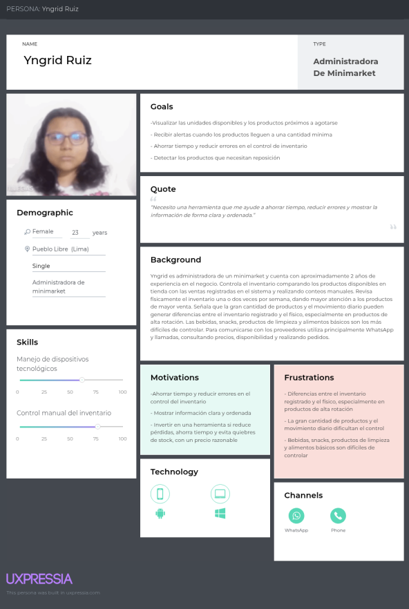

<em>Figura 2 (User Persona 1)</em>

**Segundo Segmento Objetivo (Propietarios y administradores de bodegas de barrio)**

  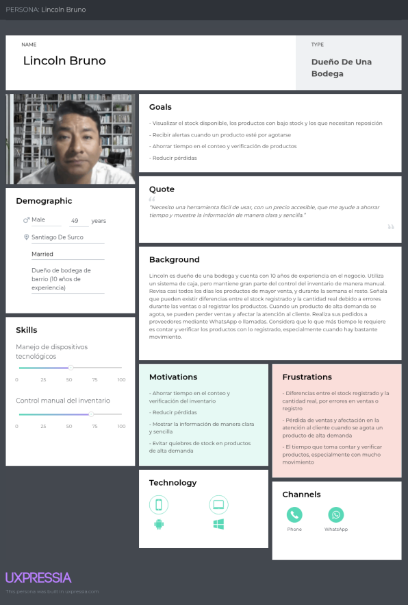

<em>Figura 3 (User Persona 2)</em>

### 2.3.2. User Task Matrix

**Primer Segmento Objetivo (Propietarios y administradores de minimarkets)**

  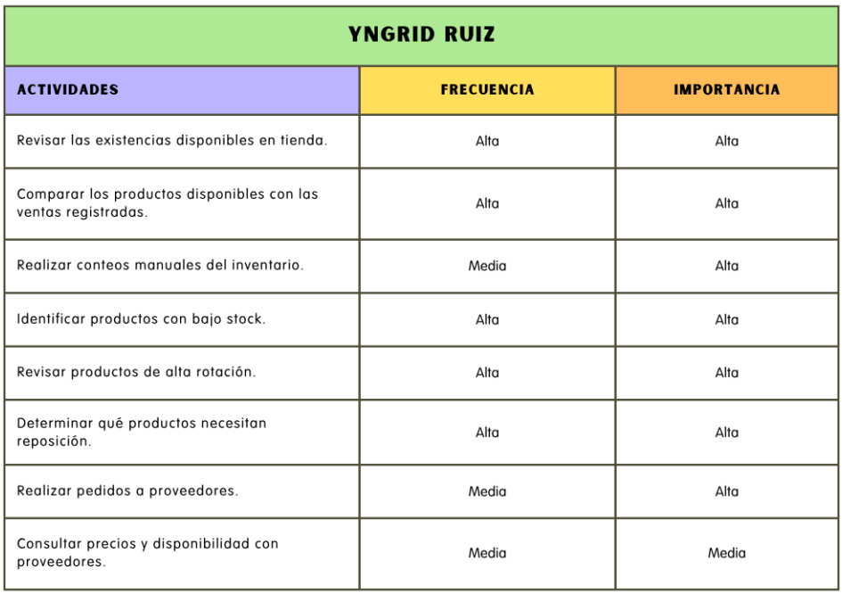

<em>Figura 4 ((User Task Matrix 1)</em>

**Segundo Segmento Objetivo (Propietarios y administradores de bodegas de barrio)**

  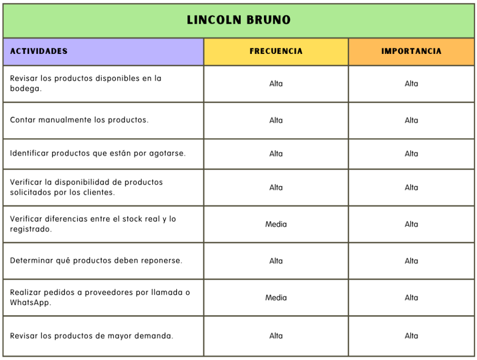

<em>Figura 4 ((User Task Matrix 2)</em>

### 2.3.3. User Journey Mapping

**Primer Segmento Objetivo (Propietarios y administradores de minimarkets)**

  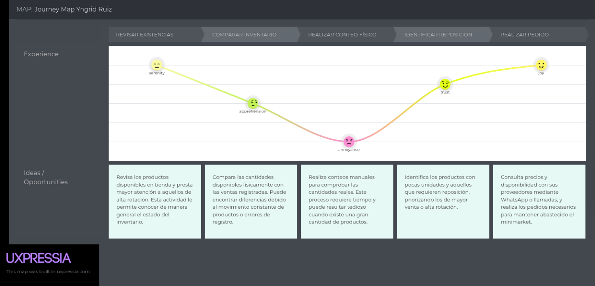

<em>Figura 6 (User Journey Map 1)</em>

**Segundo Segmento Objetivo (Propietarios y administradores de bodegas de barrio)**

  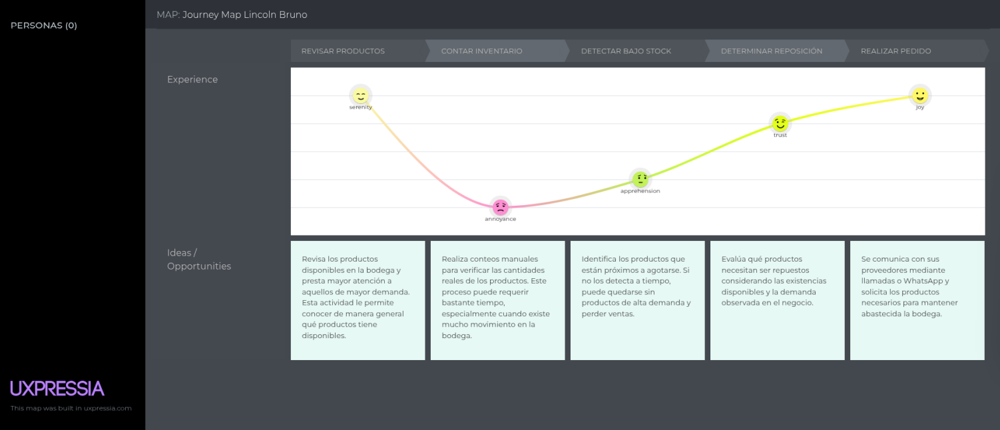

<em>Figura 7 (User Journey Map 2)</em>

### 2.3.4. Empathy Mapping

  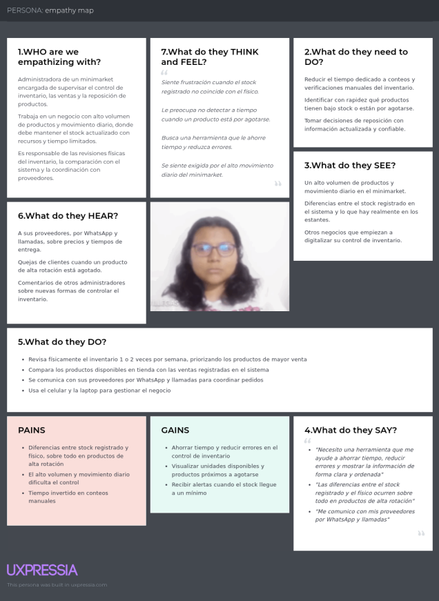

  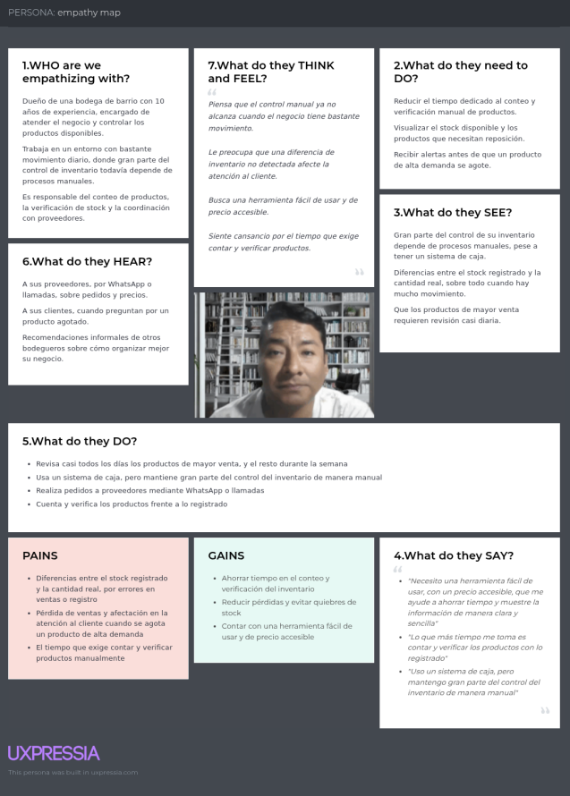

## 2.4. Big Picture Event Storming

Para el desarrollo del Big Picture Event Storming se aplicó la guía Step-by-Step Guide de Philippe Bourgault, indicada en la rúbrica del Final Problem Statement, siguiendo sus tres etapas:

- Open
- Explore
- Close

**Enlace al tablero de Miro:**

[https://miro.com/welcomeonboard/UHk1SzhpUVZrN1hGMDFlMnpHa2NUOUJMbHBId2xlc2YydGhaYmxUcC96S2hnOWpMWmdwaUVkbGRMWHFlSkhiS0t2TXR6V0JXWEhDU0JKWUNhRWFWRncyeXpmaS84aTEyUHJyU1VmcDNrWWhLd1BTZ09xNlphNUFlVWsxb1h1UXVNakdSWkpBejJWRjJhRnhhb1UwcS9BPT0hdjE=?share_link_id=472690857440](https://miro.com/welcomeonboard/UHk1SzhpUVZrN1hGMDFlMnpHa2NUOUJMbHBId2xlc2YydGhaYmxUcC96S2hnOWpMWmdwaUVkbGRMWHFlSkhiS0t2TXR6V0JXWEhDU0JKWUNhRWFWRncyeXpmaS84aTEyUHJyU1VmcDNrWWhLd1BTZ09xNlphNUFlVWsxb1h1UXVNakdSWkpBejJWRjJhRnhhb1UwcS9BPT0hdjE=?share_link_id=472690857440)

  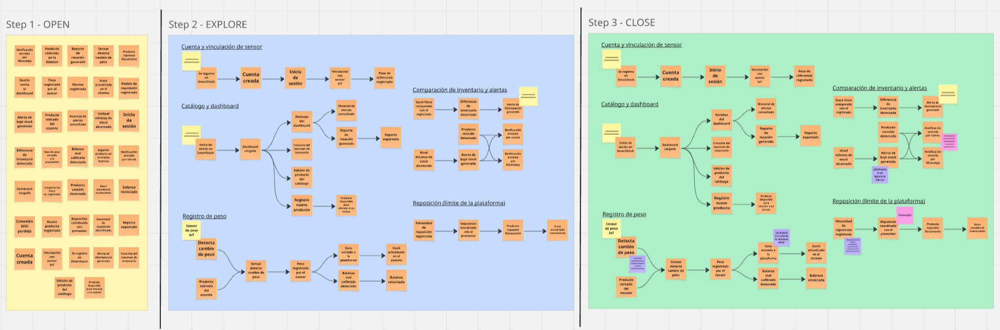

<em>Figura 10. Big Picture Event Storming.</em>

## 2.5. Ubiquitous Language

- **IoT Weight Sensor (Sensor de peso IoT):** Dispositivo físico instalado bajo un producto en el punto de venta que mide su peso de forma continua y envía esa lectura a la plataforma SmartStock para inferir el nivel de existencias disponibles.

- **Physical Stock (Stock físico):** Cantidad real de un producto presente físicamente en el minimarket o bodega en un momento determinado, obtenida a partir de la lectura del Sensor de peso IoT.

- **Registered Stock (Stock registrado):** Cantidad de un producto que figura almacenada en el sistema como existencia disponible, la cual puede o no coincidir con el Physical Stock.

- **Inventory Discrepancy (Diferencia de inventario):** Desajuste detectado entre el Physical Stock y el Registered Stock de un producto, que evidencia un posible error de conteo, venta no registrada o pérdida.

- **Minimum Stock Level (Nivel mínimo de stock):** Umbral configurado por el propietario o administrador para cada producto, a partir del cual el sistema considera que las existencias son insuficientes y debe generarse una alerta.

- **Low-Stock Alert (Alerta de bajo stock):** Notificación automática generada por SmartStock cuando el Physical Stock de un producto alcanza o desciende por debajo de su Minimum Stock Level.

- **Restocking Need (Necesidad de reposición):** Registro que identifica que un producto requiere ser abastecido nuevamente, generado a partir de una Low-Stock Alert o de la revisión del Inventory Dashboard por parte del usuario.

- **Inventory Dashboard (Panel de inventario):** Interfaz web principal donde el propietario o administrador visualiza el estado general de sus productos, las alertas activas y las diferencias de inventario detectadas.

- **Rotation Report (Reporte de rotación):** Informe generado por la plataforma que muestra el comportamiento histórico de un producto (frecuencia de venta o consumo) para apoyar la toma de decisiones de reposición.

- **Alert and Movement History (Historial de alertas y movimientos):** Registro histórico de todas las alertas generadas y los cambios de stock detectados para un producto, utilizado como respaldo analítico dentro del dashboard.

- **Store Owner / Manager (Propietario/Administrador):** Usuario principal de SmartStock, responsable del control del inventario, la revisión de alertas y la coordinación de la reposición en un minimarket o bodega de barrio.

- **Supplier (Proveedor):** Actor externo a la plataforma con quien el Store Owner coordina manualmente el reabastecimiento de productos una vez identificada una Restocking Need; esta coordinación ocurre fuera de SmartStock.

- **Third-Party Notification Service (Servicio de notificaciones de terceros):** Sistema externo (correo electrónico o WhatsApp) mediante el cual SmartStock envía las Low-Stock Alerts al Store Owner fuera de la propia plataforma web.