# Capítulo IV: Product Design

## 4.1. Style Guidelines

En este apartado estableceremos los criterios visuales y de comunicación que se utilizarán en el diseño del Landing Page y de la Web Application. El diseño estará centrado en transmitir una imagen simple, moderna y confiable, utilizando colores, tipografías, botones e iconos que permitan entender fácilmente la información. Como SmartStock está dirigido a propietarios y administradores de minimarkets y bodegas de barrio, se evitará un diseño demasiado complejo y se priorizará una interfaz sencilla y fácil de usar para los usuarios.

### 4.1.1. General Style Guidelines

#### Branding

SmartStock es operado por NexoStock. El logo se usa como ícono de 42 x 42px junto al nombre de marca en la cabecera (reducido a 34 x 34px en pantallas móviles menores a 720px), manteniendo consistencia en todas las vistas.

#### Typography

Para la identidad visual del producto, se seleccionó una tipografía que combine claridad, accesibilidad y un estilo tecnológico.

- **Tipografía:** Manrope, disponible en Google Fonts.
- **Peso 400 (Regular):** utilizado para el texto de cuerpo.
- **Peso 600 (Semibold):** aplicado en labels, botones y elementos de navegación.
- **Peso 700 (Bold):** utilizado en los títulos principales.
- **Estilo:** sans-serif geométrica, elegida para transmitir un tono técnico pero accesible.
- **Enfoque:** busca adaptarse a un producto de monitoreo IoT dirigido a dueños de bodegas, quienes no necesariamente cuentan con conocimientos técnicos.

#### Colors

La paleta se construyó sobre un azul marino como color de marca, con dos acentos adicionales (cian y verde menta) incorporados para reforzar puntos de interés visual en etiquetas, testimonios y elementos decorativos.

| Token | Valor | Uso |
|---|---|---|
| `--navy` | `#082b4c` | Titulares, marca, botón primario, foco de navegación |
| `--blue` | `#1266d4` | Enlaces, acentos, estado hover de botones |
| `--cyan` | `#0ea5a8` | Etiquetas destacadas (eyebrow) y acentos secundarios |
| `--mint` | `#2fcf78` | Detalles decorativos (blobs de fondo, indicador de tarjeta al hover) |
| `--ink` | `#172033` | Texto de cuerpo |
| `--muted` | `#667085` | Texto secundario / descripciones |
| `--border` | `#dce6ef` | Bordes y separadores |
| `--soft` | `#f5f9fd` | Fondos alternos de sección |

El blanco (`#ffffff`) es el fondo dominante, reforzando una identidad limpia y confiable, apropiada para un producto que maneja datos de inventario de un negocio.

Estas decisiones se sustentan en los principios de claridad, confianza y accesibilidad: el azul marino como color dominante transmite seriedad y profesionalismo sin resultar frío; los acentos cian y verde menta se reservan para elementos puntuales de refuerzo visual (etiquetas, indicadores de interacción), evitando sobrecargar la interfaz; y el uso del blanco como fondo dominante prioriza la legibilidad de los datos de inventario que el producto presenta al usuario.

<p align="center">
  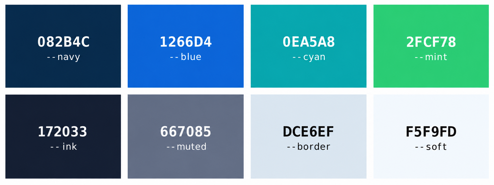
</p>

#### Spacing

Para mantener una interfaz consistente y facilitar la lectura, se establecieron criterios de espaciado y dimensiones para los componentes.

- **Border-radius:** escala de 12px como base (inputs y contenedores generales), 10px en botones y 14px en tarjetas y tablas, dando mayor presencia visual a los elementos interactivos y a los contenedores de datos.
- **Ancho máximo de contenido:** 1040px.
- **Propósito:** mantener líneas de lectura cómodas y evitar que el contenido se extienda demasiado en pantallas grandes.

#### Tono de comunicación

El tono de comunicación definido es cercano, práctico y directo, priorizando la confianza y la facilidad de comprensión sobre el lenguaje técnico.

- **Testimonios:** se utilizan testimonios en primera persona para generar identificación con los usuarios.
  - "Antes me enteraba de que el arroz se había acabado cuando un cliente lo pedía…"

- **Llamadas a la acción:** son directas y orientadas a la acción.
  - "Empezar prueba gratuita"
  - "Sin tarjeta · Instalación en menos de un día"

- **Enfoque:** en las cuatro dimensiones de tono definidas para el producto:
  - **Divertido – Serio:** más cerca de Serio, priorizando la confianza sobre el humor, dado que se maneja información de inventario y ventas del negocio.
  - **Formal – Casual:** más cerca de Casual, evitando lenguaje corporativo rígido para conectar con dueños de bodegas y minimarkets.
  - **Respetuoso – Irreverente:** más cerca de Respetuoso, reconociendo que el usuario no necesariamente cuenta con conocimientos técnicos y evitando minimizar sus dudas.
  - **Entusiasta – Sereno:** más cerca de Entusiasta, transmitiendo confianza y motivación para adoptar la solución.

- **Objetivo:** facilitar la comprensión del producto y conectar con los usuarios sin recurrir a tecnicismos innecesarios.

### 4.1.2. Web Style Guidelines

- **Botones:** se definieron tres variantes: `.btn` como botón primario, con relleno en degradado de navy y estado hover con elevación (desplazamiento sutil hacia arriba) y sombra reforzada; `.btn.ghost` como botón secundario, con borde y sin relleno; y `.btn.block` como botón de ancho completo, utilizado en las tarjetas de planes. Las tres variantes cuentan con un estado hover definido.

<p align="center">
  
</p>

<p align="center">
  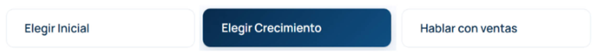
</p>

- **Formularios:** los campos de entrada utilizan un borde de 1px y un radio de 8px. El estado de error se identifica mediante `aria-invalid="true"`, acompañado de un borde rojo `#c0392b` y un mensaje de error asociado mediante `aria-describedby`. La validación se ejecuta en el evento blur, en lugar de realizarse mientras el usuario escribe, evitando marcar como inválido un campo que aún se encuentra en proceso de completarse.

<p align="center">
  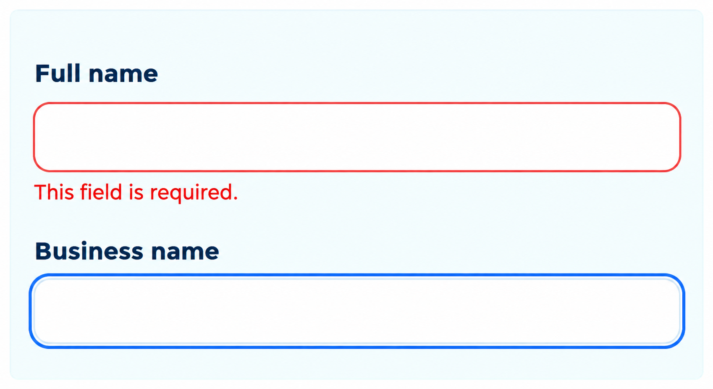
</p>

- **Foco visible:** se define `:focus-visible` con un outline azul de 2px en toda la interfaz, facilitando la navegación mediante teclado como parte de los criterios de accesibilidad.

- **Avatares de testimonios:** cada testimonio incorpora un avatar circular con las iniciales de la persona sobre un fondo en degradado (rosa, azul o verde según el caso), reforzando la identificación visual de cada historia sin depender de fotografías reales.

- **Responsive breakpoints:** se establecen dos puntos de quiebre principales: 900px, donde las grillas de 3 o 2 columnas se reducen a una sola columna; y 720px, donde la barra de navegación se transforma en un menú hamburguesa y el botón "Crear cuenta" se incorpora dentro del menú móvil. Adicionalmente, se definieron puntos de quiebre intermedios (850px, 980px y 1180px) para ajustar con mayor precisión el espaciado y la disposición de secciones específicas como testimonios y tarjetas.

- **Reduced motion:** se respeta la configuración `prefers-reduced-motion: reduce`, desactivando las transiciones y animaciones para los usuarios que tienen activada esta preferencia en su sistema, como parte del compromiso de accesibilidad e inclusión declarado en el propio sitio (sección 6 de Términos y Condiciones).

---

## 4.2. Information Architecture

La arquitectura de información de SmartStock integra tanto el Landing Page como la Web Application dentro de una misma estructura, debido a que ambos productos comparten una lógica de navegación coherente, una misma preferencia de idioma almacenada en el navegador y un lenguaje visual y de interacción consistente.

Ambos productos utilizan la misma preferencia de idioma mediante `localStorage`, utilizando la clave `smartstock.lang`, lo cual permite mantener el idioma seleccionado por el usuario al navegar entre ambos sistemas.

### Mapa de Arquitectura de Información

<p align="center">
  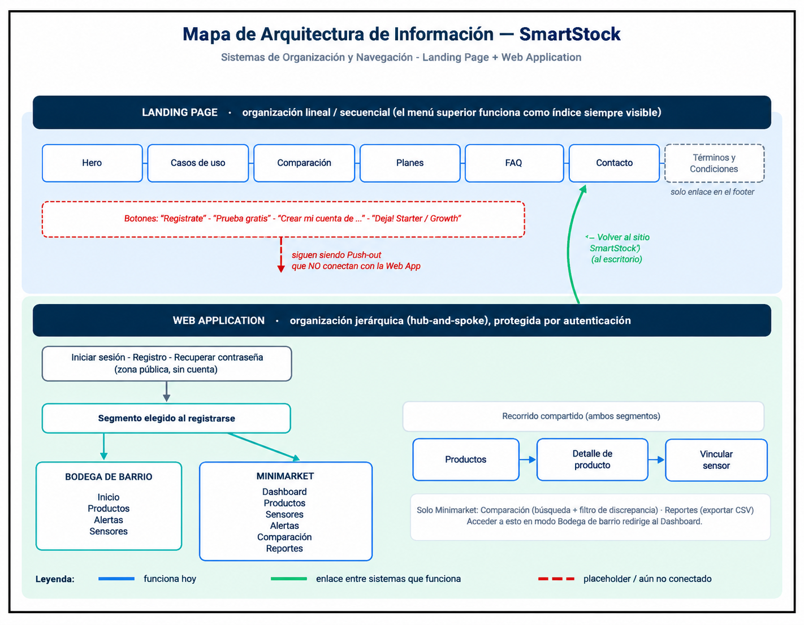
</p>

El mapa de arquitectura de información representa la organización de ambos productos y muestra también las conexiones existentes entre ellos. Asimismo, permite identificar visualmente la navegación que ya se encuentra implementada y aquella integración que todavía se encuentra pendiente.

### 4.2.1. Organization Systems

Para la organización visual del contenido, SmartStock utiliza diferentes esquemas dependiendo del tipo de información y del flujo que realiza el usuario.

#### Organización jerárquica

La organización jerárquica se utiliza principalmente en la Web Application.

El Dashboard funciona como el punto central de navegación y, desde ahí, el usuario puede acceder a las principales funcionalidades del sistema.

Dentro de la sección de productos existe una jerarquía más profunda:

**Dashboard → Productos → Detalle de producto → Vincular sensor**

Esto permite que el usuario avance desde una sección general hacia información cada vez más específica.

Además, dentro del sidebar, las funcionalidades principales se muestran primero, mientras que opciones secundarias como Configuración y Cerrar sesión se encuentran ubicadas al final del menú.

<p align="center">
  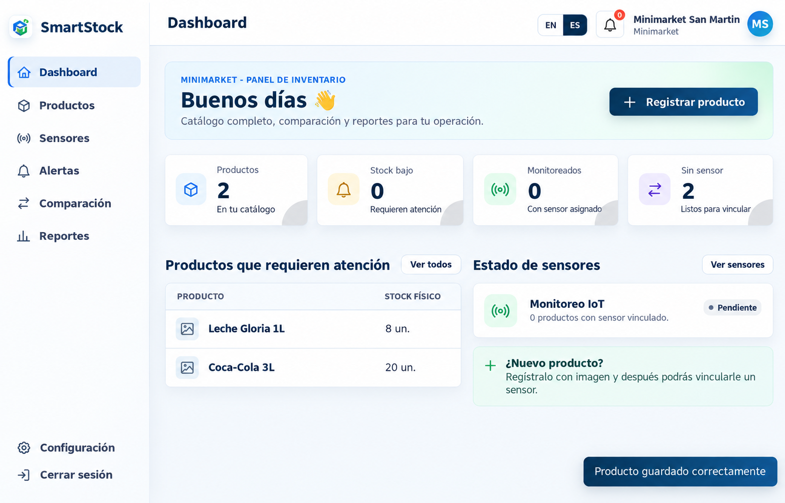
</p>

<p align="center">
  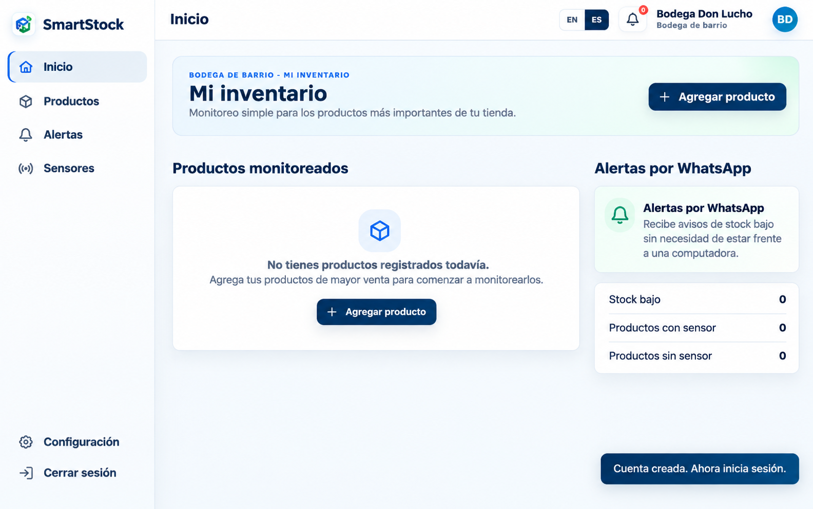
</p>

#### Organización secuencial

La organización secuencial se utiliza en los procesos que requieren que el usuario complete una serie de pasos en un orden determinado.

Por ejemplo, durante el proceso de incorporación del usuario se sigue el siguiente flujo:

**Registro → Elección de segmento → Inicio de sesión → Registro del primer producto**

De esta manera, el usuario es guiado paso a paso hasta comenzar a utilizar el sistema.

Este mismo principio también se aplica en el Landing Page, cuya información está organizada para ser recorrida de arriba hacia abajo:

**Hero → Casos de uso → Comparación → Planes → FAQ → Contacto**

#### Organización matricial

La organización matricial se utiliza principalmente en las tablas de Productos y Comparación.

En la sección Productos, cada producto se relaciona con diferentes atributos como:

- Categoría.
- Estado.
- Stock.
- Umbral.
- Sensor.

En la sección Comparación, cada producto se relaciona principalmente con:

- Stock físico.
- Stock registrado.
- Diferencia entre ambos valores.

Este tipo de organización permite visualizar diferentes atributos de un mismo producto dentro de una sola fila y aplicar filtros sin perder el contexto de la información.

#### Organización por audiencia

La organización por audiencia representa una de las decisiones más importantes dentro de SmartStock.

<p align="center">
  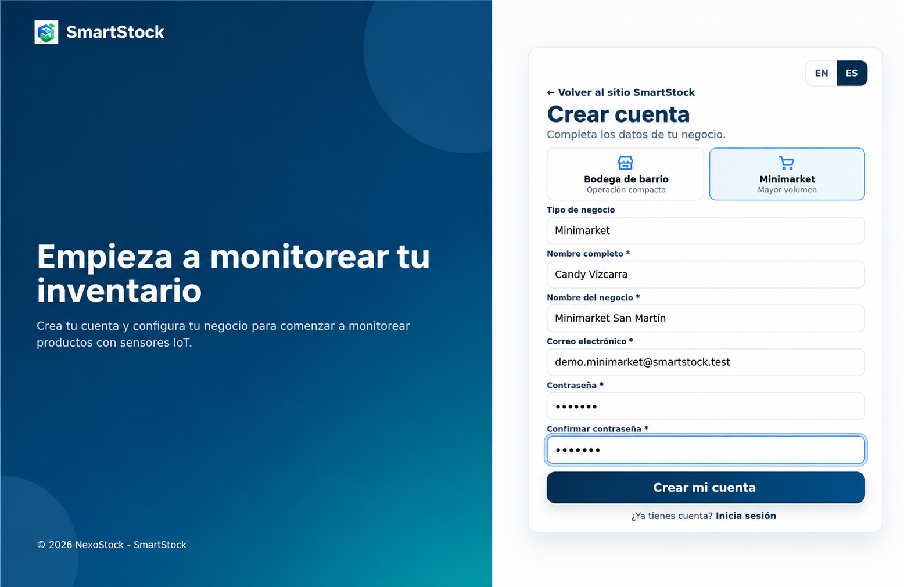
</p>

Las funcionalidades disponibles se organizan dependiendo del segmento seleccionado por el usuario durante el registro.

Los segmentos utilizados son:

- Bodega de barrio.
- Minimarket.

Esta diferenciación se aplica tanto en el menú lateral como en las rutas disponibles dentro de la aplicación.

De esta manera, cada tipo de usuario visualiza únicamente las funcionalidades correspondientes a las necesidades de su negocio.

#### Organización por tópicos

El Landing Page utiliza una organización por tópicos.

Cada sección presenta un tema específico dentro de la página, por ejemplo:

- Casos de uso.
- Comparación.
- Planes.
- FAQ.

Estas secciones pueden ser accedidas directamente desde el menú mediante enlaces internos.

#### Organización cronológica

La organización cronológica se utiliza en la sección de Alertas.

Los eventos más recientes aparecen primero mediante referencias de tiempo como:

- Hace 4 min.
- Hace 12 min.
- Hace 30 min.

Esto permite que el usuario pueda identificar primero los eventos más recientes y atender rápidamente las situaciones que puedan requerir su atención.

#### Organización alfabética

Actualmente no se utiliza una organización alfabética dentro del producto.

Debido a que los catálogos manejados durante el alcance actual del proyecto son relativamente pequeños, se priorizó la organización basada en el estado de los productos.

Por ejemplo, los productos con stock bajo pueden mostrarse antes que los productos con niveles normales, ya que esta información resulta más relevante para la gestión del inventario.

#### Limitación actual de integración

Actualmente existe una limitación de integración entre el Landing Page y la Web Application.

Desde la Web Application, el usuario puede regresar hacia el Landing Page utilizando el logo de SmartStock o mediante el enlace:

**"← Volver al sitio SmartStock"**

Sin embargo, actualmente el Landing Page todavía no redirige hacia la Web Application.

Los siguientes botones continúan utilizando enlaces temporales `href="#"`:

- Regístrate.
- Prueba gratis.
- Crear mi cuenta de bodega.
- Crear mi cuenta de minimarket.
- Elegir Starter.
- Elegir Growth.

Por este motivo, esta funcionalidad se considera una limitación conocida del alcance actual del proyecto y no una integración completamente implementada.

### 4.2.2. Labeling Systems

Las etiquetas utilizadas en SmartStock fueron diseñadas buscando mantener textos simples, cortos y fáciles de comprender.

#### Landing Page

En el Landing Page, las etiquetas del menú corresponden directamente con los títulos de las diferentes secciones.

Por ejemplo:

- Casos de uso.
- Comparación.
- Planes.
- FAQ.

Estas etiquetas utilizan una o dos palabras y funcionan al mismo tiempo como enlaces internos hacia las secciones correspondientes.

Esto evita inconsistencias entre el nombre mostrado en el menú y el contenido al cual dirige cada opción.

#### Web Application
En la Web Application, los elementos del sidebar combinan un ícono con una etiqueta corta.

Entre las principales etiquetas se encuentran:

- Dashboard.
- Productos.
- Sensores.
- Alertas.
- Comparación.
- Reportes.

Los íconos ayudan a complementar visualmente el significado de cada opción, permitiendo mantener textos cortos sin perder claridad.

<p align="center">
  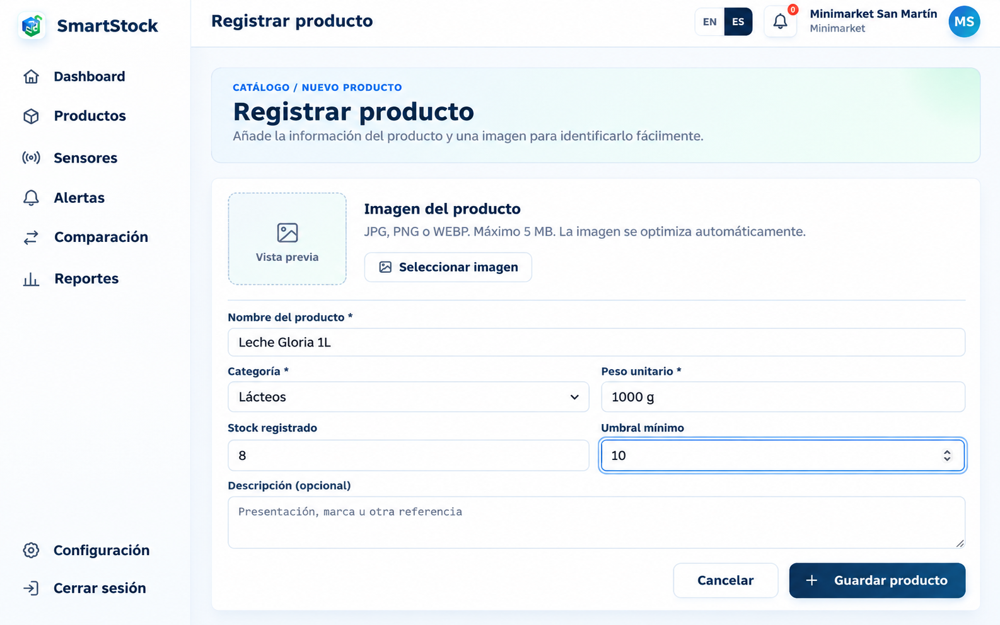
</p>

Además, tanto el Landing Page como la Web Application se encuentran disponibles en inglés y español.

Ambos productos comparten la misma preferencia de idioma mediante:

`localStorage`

Clave utilizada:

`smartstock.lang`

Esto permite que el idioma seleccionado por el usuario permanezca activo al desplazarse entre ambos productos.

#### Diferencia de etiquetado según el segmento

Existe una diferencia intencional en la etiqueta utilizada para la ruta interna `#dashboard`.

Para usuarios del segmento **Bodega de barrio**, esta sección se denomina:

**Inicio**

Mientras que para los usuarios del segmento **Minimarket**, la misma sección se denomina:

**Dashboard**

Esta diferencia fue implementada de manera intencional para utilizar una terminología más sencilla en el segmento de negocio más pequeño.

### 4.2.3. SEO Tags and Meta Tags

#### Landing Page

El Landing Page incluye las principales etiquetas SEO y Meta Tags solicitadas.

Tanto `index.html` como `terms-of-service.html` cuentan con:

- `<title>`
- `<meta name="description">`
- `<meta name="keywords">`
- `<meta name="author">`

La etiqueta `<title>` contiene un título descriptivo de la página.

La etiqueta `<meta name="description">` contiene una descripción del contenido y puede mostrarse de acuerdo con el idioma seleccionado.

La etiqueta `<meta name="keywords">` contiene términos relacionados con el proyecto como:

- minimarket.
- corner store.
- SmartStock.
- NexoStock.

Finalmente, la etiqueta de autor utiliza:

```html
<meta name="author" content="NexoStock">

#### Web Application

Actualmente, la Web Application cuenta únicamente con la etiqueta `<title>`. Por ello, se identificó la necesidad de incorporar las etiquetas de descripción, palabras clave y autor para completar la configuración de SEO y Meta Tags.

Se propone agregar las siguientes etiquetas:

```html
<meta name="description" content="SmartStock Web Application — gestiona tu inventario monitoreado por sensores IoT, alertas y comparaciones de stock.">
<meta name="keywords" content="SmartStock, NexoStock, gestión de inventario, sensores IoT, monitoreo de stock">
<meta name="author" content="NexoStock">
```

De manera opcional, también puede utilizarse:

```html
<meta name="robots" content="noindex">
```

Esta etiqueta puede emplearse para indicar que la Web Application, al tratarse de un sistema protegido o autenticado, no está destinada a ser indexada por los motores de búsqueda.

---

### 4.2.4. Searching Systems

El sistema de búsqueda de SmartStock se encuentra implementado principalmente dentro de la Web Application, mientras que el Landing Page no requiere un mecanismo de búsqueda debido a su estructura de navegación por secciones.

#### Landing Page

El Landing Page no incorpora un sistema de búsqueda, debido a que presenta una estructura de una sola página con secciones claramente diferenciadas y un menú superior que permite acceder directamente a cada una de ellas.

#### Web Application

La Web Application incorpora sistemas de búsqueda y filtrado en las secciones de **Productos**, **Comparación** y **Alertas**, permitiendo al usuario localizar información específica de manera más rápida.

##### Productos

La sección Productos permite realizar una búsqueda en tiempo real utilizando los siguientes criterios:

- Nombre del producto.
- Categoría.

También cuenta con filtros según el estado del producto:

- Todos los estados.
- Stock bajo.
- Normal.
- Sin sensor.

<p align="center">
  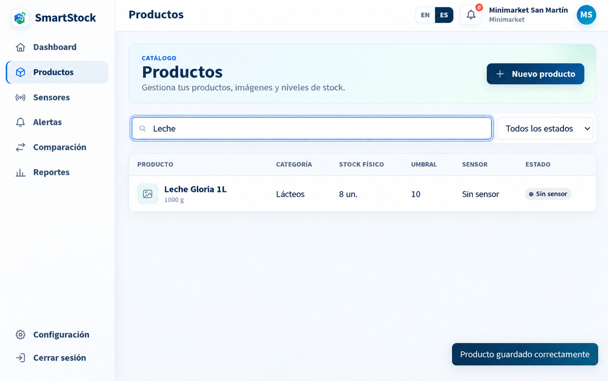
</p>

Cuando el usuario realiza una búsqueda o aplica un filtro, las filas que no coinciden con los criterios establecidos son ocultadas. Las filas que coinciden mantienen la información correspondiente a:

- Imagen.
- Categoría.
- Stock.
- Umbral.
- Sensor.
- Estado.

##### Comparación

La sección Comparación incorpora un sistema de búsqueda por prefijo y filtros que permiten organizar los productos según su situación.

Los filtros disponibles son:

- Todos.
- Con discrepancia.
- Sin discrepancia.

El sistema actualiza el número de productos visibles y permite identificar aquellos que presentan una diferencia superior al **10 %** entre el stock registrado y el stock físico.

<p align="center">
  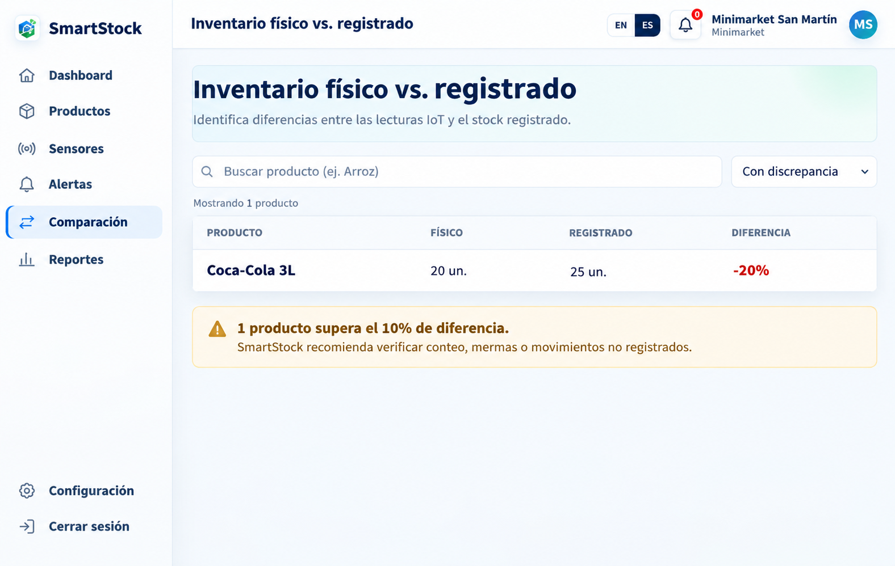
</p>

##### Alertas

La sección Alertas permite organizar las notificaciones mediante diferentes categorías:

- Todas.
- Stock bajo.
- Discrepancias.
- Sensores.

Los contadores de cada categoría se actualizan según las alertas disponibles. Cada alerta conserva información relevante como:

- Icono.
- Mensaje.
- Tiempo relativo desde su generación.

<p align="center">
  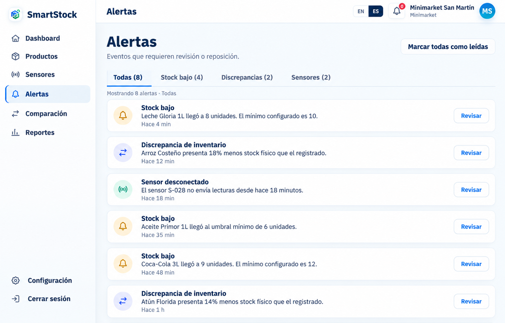
</p>

---

### 4.2.5. Navigation Systems

SmartStock utiliza diferentes sistemas de navegación para facilitar el desplazamiento del usuario tanto dentro del Landing Page como dentro de la Web Application.

#### Landing Page

El Landing Page utiliza un menú superior persistente como sistema de navegación global. Este menú permite acceder directamente a las diferentes secciones de la página mediante enlaces internos.

También se cuenta con un pie de página que incorpora navegación contextual mediante enlaces legales, información secundaria y enlaces a redes sociales.

La navegación mediante anclas permite acceder directamente a secciones como:

- Casos de uso.
- Comparación.
- Planes.
- FAQ.
- Contacto.

#### Web Application

La Web Application utiliza una barra lateral persistente como sistema de navegación global.

Las opciones disponibles dependen del segmento seleccionado por el usuario. En pantallas pequeñas, la barra lateral se adapta mediante un menú tipo hamburguesa.

La barra superior incorpora diferentes elementos de navegación e información:

- Selector de idioma.
- Campana de notificaciones.
- Contador de notificaciones no leídas.
- Nombre y tipo de negocio.
- Avatar con las iniciales del usuario.

La campana de notificaciones permite acceder a la sección de **Alertas**.

El bloque que contiene la información del negocio funciona además como un indicador de identidad, ayudando al usuario a reconocer qué cuenta y qué tipo de negocio está utilizando.

Dentro del Detalle de producto también se proporciona contexto adicional mediante una navegación similar a un breadcrumb:

<p align="center">
  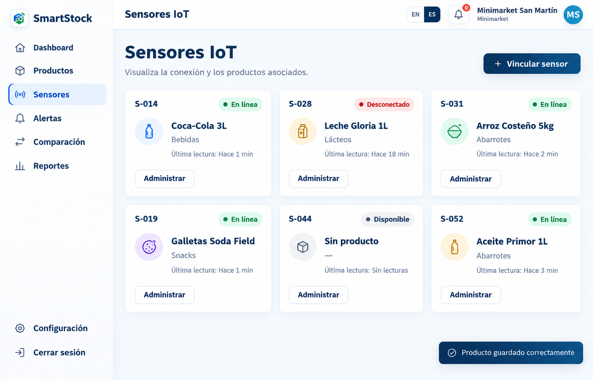
</p>

**Productos / Categoría**

Esto permite identificar la ubicación actual dentro de la aplicación y regresar hacia niveles anteriores.

#### Navegación entre el Landing Page y la Web Application

Actualmente, la Web Application permite regresar al Landing Page mediante:

- El logotipo de SmartStock.
- La opción **← Volver al sitio SmartStock**.

<p align="center">
  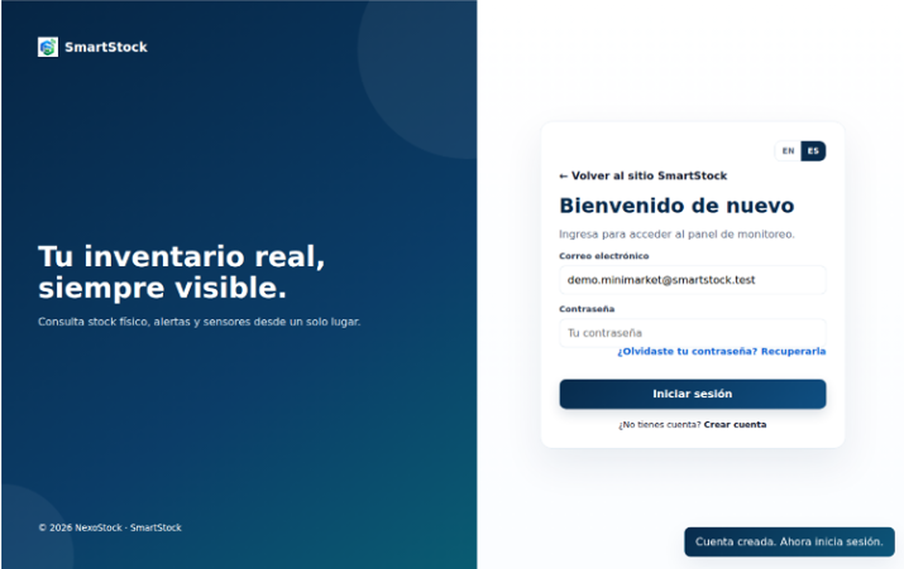
</p>

Sin embargo, la navegación desde el Landing Page hacia la Web Application todavía no se encuentra completamente implementada.

Las llamadas a la acción mantienen temporalmente enlaces como `href="#"` en elementos como:

- Regístrate.
- Prueba gratis.
- Crear mi cuenta de bodega.
- Crear mi cuenta de minimarket.
- Elegir Starter.
- Elegir Growth.

Esta integración pendiente constituye una limitación actual del alcance implementado.

---

## 4.3. Landing Page UI Design

El diseño de la interfaz de usuario (UI) de la página de inicio de SmartStock es clave para captar la atención de los administradores y propietarios de bodegas y minimarkets, ya que los guía hacia una acción clara: comprender y adoptar una solución inteligente de gestión de inventarios. Se ha priorizado una experiencia continua, de modo que cada elemento de la página sea accesible, interactivo y fácil de usar, transmitiendo confianza, mientras refleja el compromiso de SmartStock con la innovación tecnológica y la claridad en la comunicación.

### 4.3.1. Landing Page Wireframe

El wireframe de SmartStock organiza de forma clara la página de inicio, mostrando la secuencia lógica de secciones: desde el problema de la gestión del inventario, pasando por las funcionalidades principales, hasta los beneficios que ofrece la plataforma.

### Desktop:

**Figura 15. Interfaz principal de bienvenida del landing page de SmartStock.**

<p align="center">
  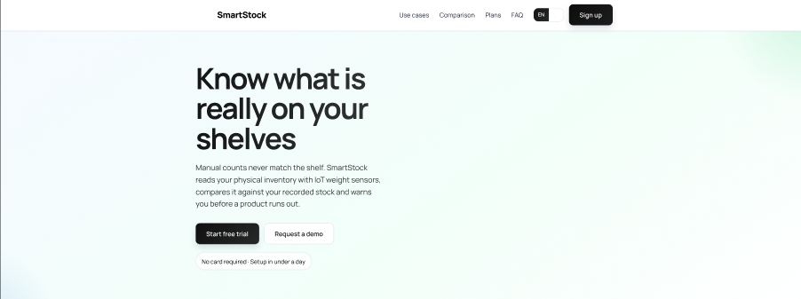
</p>

> *Nota.* Wireframe de la estructura principal de inicio del landing page de SmartStock en versión de escritorio.

**Figura 16. Interfaz sección de problemas y beneficios de SmartStock en versión de escritorio.**

<p align="center">
  
</p>

> *Nota.* Wireframe de la estructura de la sección de problemas y beneficios de SmartStock en versión de escritorio.

**Figura 17. Interfaz de la sección de casos de uso de SmartStock en versión de escritorio.**

<p align="center">
  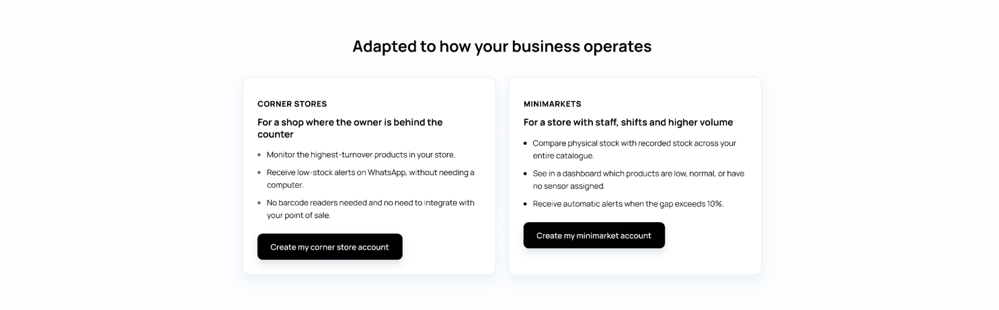
</p>

> *Nota.* Wireframe de la estructura de la sección de casos de uso de SmartStock en versión de escritorio.

**Figura 18. Interfaz de la sección comparativa de SmartStock en versión de escritorio.**

<p align="center">
  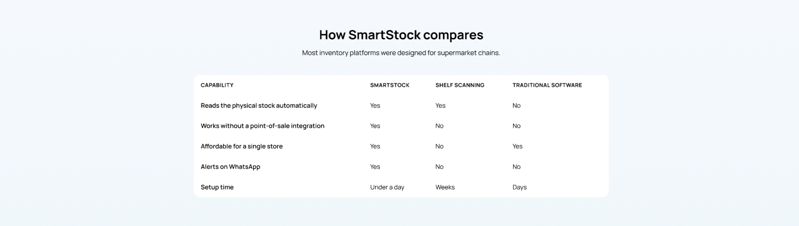
</p>

> *Nota.* Wireframe de la estructura de la sección comparativa de SmartStock en versión de escritorio.

**Figura 19. Interfaz de la sección de planes de SmartStock en versión de escritorio.**

<p align="center">
  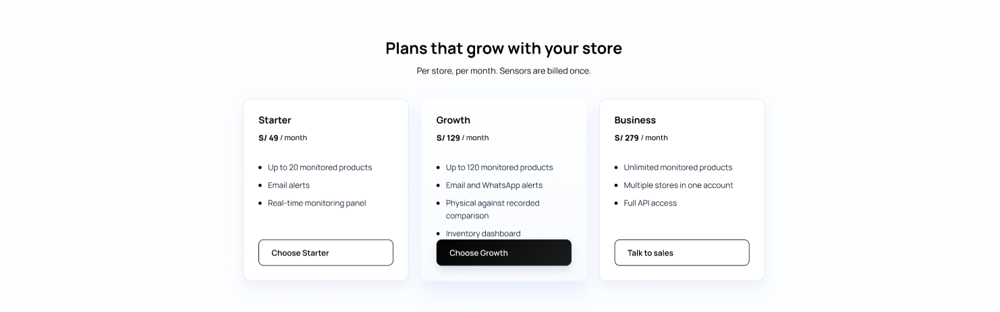
</p>

> *Nota.* Wireframe de la estructura de la sección de planes de SmartStock en versión de escritorio.

**Figura 20. Interfaz de la sección de testimonios de SmartStock en versión de escritorio.**

<p align="center">
  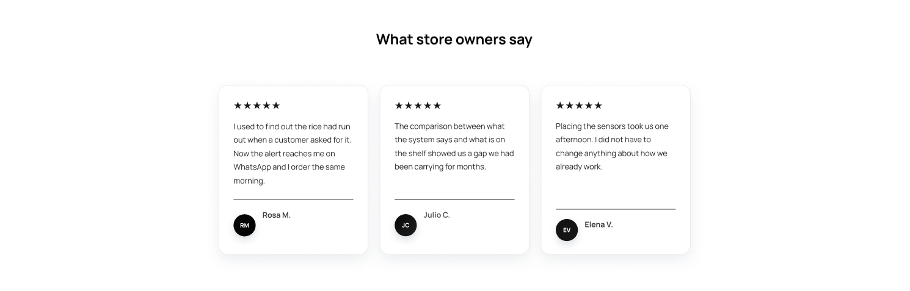
</p>

> *Nota.* Wireframe de la estructura de la sección de testimonios de SmartStock en versión de escritorio.

**Figura 21. Interfaz de la sección de preguntas frecuentes de SmartStock en versión de escritorio.**

<p align="center">
  
</p>

> *Nota.* Wireframe de la estructura de la sección de preguntas frecuentes de SmartStock en versión de escritorio.

**Figura 22. Interfaz del formulario de demostración de SmartStock en versión de escritorio.**

<p align="center">
  
</p>

> *Nota.* Wireframe de la estructura del formulario de demostración de SmartStock en versión de escritorio.
> 
> **Figura 23. Pie de página del landing page de SmartStock.**
> 
> <p align="center">
>   
> </p>
> 
> > *Nota.* Wireframe del pie de página del landing page de SmartStock.
> 
> ### Mobile:
> 
> **Figura 24. Interfaz de la interfaz principal de inicio de SmartStock en versión móvil.**
> 
> <p align="center">
>   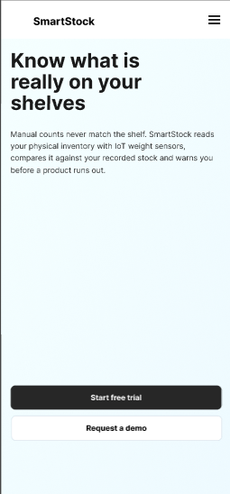
> </p>
> 
> > *Nota.* Wireframe de la estructura principal de inicio del landing page de SmartStock adaptada para dispositivos móviles.
> 
> **Figura 25. Interfaz de la sección de problemas y beneficios de SmartStock en versión móvil.**
> 
> <p align="center">
>   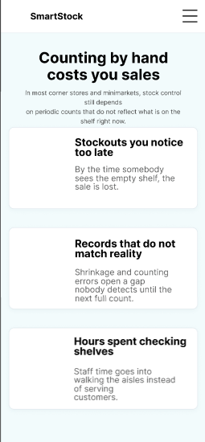
> </p>
> 
> > *Nota.* Wireframe de la estructura de la sección de problemas y beneficios de SmartStock adaptada para dispositivos móviles.
> 
> **Figura 26. Interfaz de la sección de casos de uso de SmartStock en versión móvil.**
> 
> <p align="center">
>   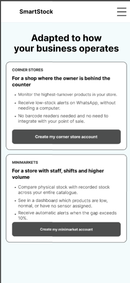
> </p>
> 
> > *Nota.* Wireframe de la estructura de la sección de casos de uso de SmartStock adaptada para dispositivos móviles.
> 
> **Figura 27. Interfaz de la sección comparativa de SmartStock en versión móvil.**
> 
> <p align="center">
>   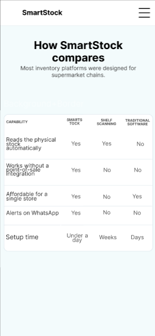
> </p>
> 
> > *Nota.* Wireframe de la estructura de la sección comparativa de SmartStock adaptada para dispositivos móviles.
> 
> **Figura 28. Interfaz de la sección de planes de SmartStock en versión móvil.**
> 
> <p align="center">
>   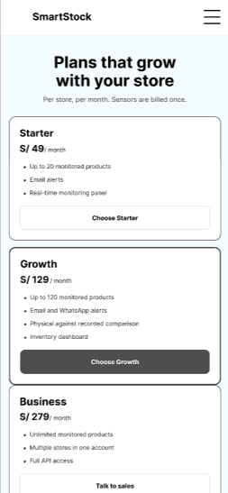
> </p>
> 
> > *Nota.* Wireframe de la estructura de la sección de planes de SmartStock adaptada para dispositivos móviles.
> 
> **Figura 29. Interfaz de la sección de testimonios de SmartStock en versión móvil.**
> 
> <p align="center">
>   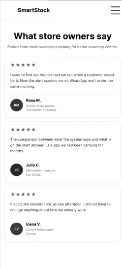
> </p>
> 
> > *Nota.* Wireframe de la estructura de la sección de testimonios de SmartStock adaptada para dispositivos móviles.
> 
> **Figura 30. Interfaz de la sección de preguntas frecuentes de SmartStock en versión móvil.**
> 
> <p align="center">
>   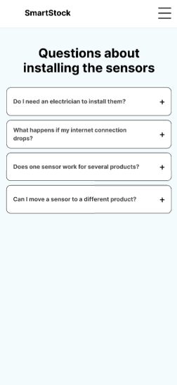
> </p>
> 
> > *Nota.* Wireframe de la estructura de la sección de preguntas frecuentes de SmartStock adaptada para dispositivos móviles.
> 
> **Figura 31. Interfaz del formulario de demostración de SmartStock en versión móvil.**
> 
> <p align="center">
>   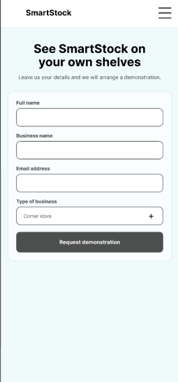
> </p>
> 
> > *Nota.* Wireframe de la estructura del formulario de demostración de SmartStock adaptada para dispositivos móviles.
> 
> **Figura 32. Interfaz del menú de navegación de SmartStock en versión móvil.**
> 
> <p align="center">
>   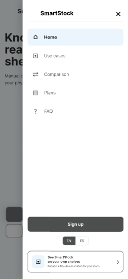
> </p>
> 
> > *Nota.* Wireframe de la estructura del menú de navegación de SmartStock adaptado para dispositivos móviles.
> 
> ---
> 
> ### 4.3.2. Landing Page Mock-up
> 
> El mock-up de la página de inicio de SmartStock actúa como un mapa visual que organiza la estructura y el flujo de la información, mientras cada sección conduce al usuario desde la identificación del problema hasta la presentación de las funcionalidades y beneficios de la plataforma.
> 
> **Figura 33. Interfaz principal de inicio del landing page de SmartStock en versión de escritorio.**
> 
> <p align="center">
>   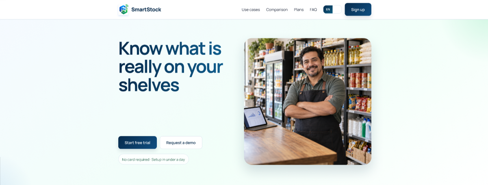
> </p>
> 
> > *Nota.* Mockup de la interfaz principal de inicio del landing page de SmartStock en versión de escritorio.
> 
> **Figura 34. Interfaz de problemas y beneficios de SmartStock en versión de escritorio.**
> 
> <p align="center">
>   
> </p>
> 
> > *Nota.* Mockup de la interfaz de problemas y beneficios de SmartStock en versión de escritorio.
> 
> **Figura 35. Interfaz de casos de uso de SmartStock en versión de escritorio.**
> 
> <p align="center">
>   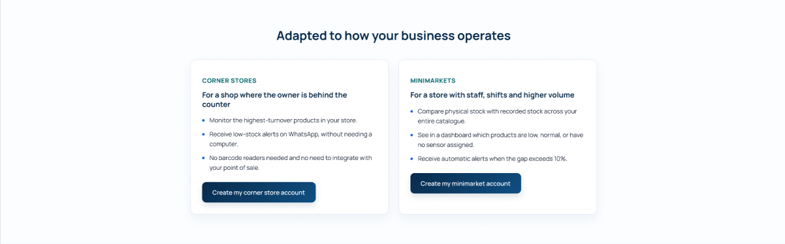
> </p>
> 
> > *Nota.* Mockup de la interfaz de casos de uso de SmartStock en versión de escritorio.
> 
> **Figura 36. Interfaz de planes de SmartStock en versión de escritorio.**
> 
> <p align="center">
>   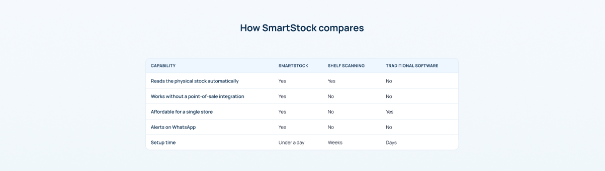
> </p>
> 
> > *Nota.* Mockup de la interfaz de planes de SmartStock en versión de escritorio.
> 
> **Figura 37. Interfaz principal de bienvenida del landing page de SmartStock.**
> 
> <p align="center">
>   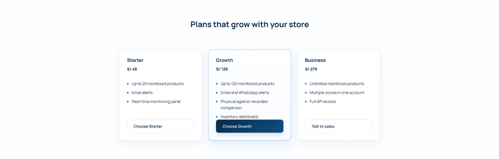
> </p>
> 
> > *Nota.* Imagen de la interfaz principal de bienvenida del landing page de SmartStock.
> 
> **Figura 38. Interfaz de testimonios de SmartStock en versión de escritorio.**
> 
> <p align="center">
>   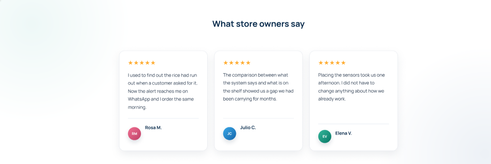
> </p>
> 
> > *Nota.* Mockup de la interfaz de testimonios de SmartStock en versión de escritorio.
> 
> **Figura 39. Interfaz de preguntas frecuentes de SmartStock en versión de escritorio.**
> 
> <p align="center">
>   
> </p>
> 
> > *Nota.* Mockup de la interfaz de preguntas frecuentes de SmartStock en versión de escritorio.
> 
> **Figura 40. Interfaz del formulario de demostración de SmartStock en versión de escritorio.**
> 
> <p align="center">
>   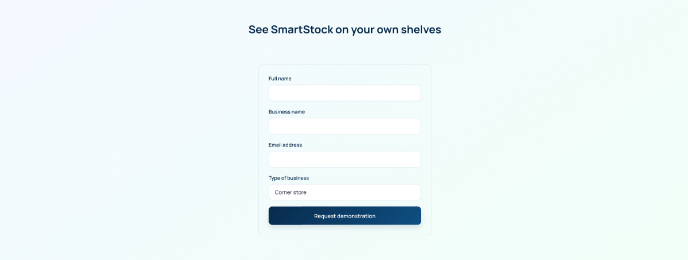
> </p>
> 
> > *Nota.* Mockup de la interfaz del formulario de demostración de SmartStock en versión de escritorio.
> 
> **Figura 41. Pie de página de la versión de escritorio de SmartStock.**
> 
> <p align="center">
>   
> </p>
> 
> > *Nota.* Mockup del pie de página de SmartStock.
> 
> ### Mobile:
> 
> **Figura 42. Interfaz principal de inicio del landing page de SmartStock en versión móvil.**
> 
> <p align="center">
>   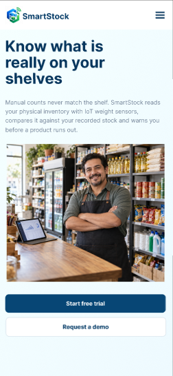
> </p>
> 
> > *Nota.* Mockup de la interfaz principal de inicio del landing page de SmartStock adaptada para dispositivos móviles.
> 
> **Figura 43. Interfaz de problemas y beneficios de SmartStock en versión móvil.**
> 
> <p align="center">
>   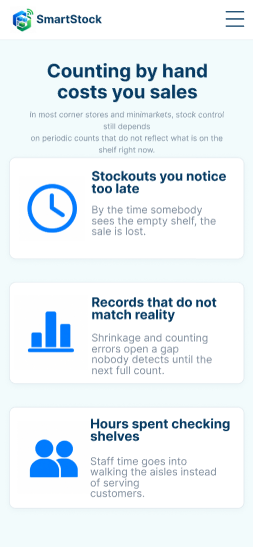
> </p>
> 
> > *Nota.* Mockup de la interfaz de problemas y beneficios de SmartStock adaptada para dispositivos móviles.
> 
> **Figura 44. Interfaz de casos de uso de SmartStock en versión móvil.**
> 
> <p align="center">
>   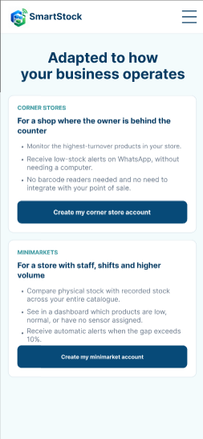
> </p>
> 
> > *Nota.* Mockup de la interfaz de casos de uso de SmartStock adaptada para dispositivos móviles.
> 
> **Figura 45. Interfaz comparativa de SmartStock en versión móvil.**
> 
> <p align="center">
>   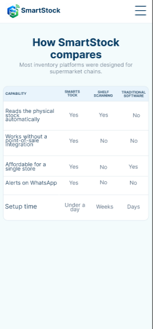
> </p>
> 
> > *Nota.* Mockup de la interfaz comparativa de SmartStock en versión móvil.
> 
> **Figura 46. Interfaz de planes de SmartStock en versión móvil.**
> 
> <p align="center">
>   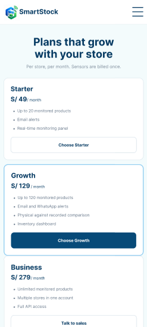
> </p>
> 
> > *Nota.* Mockup de la interfaz de planes de SmartStock en versión móvil.
> 
> **Figura 47. Interfaz de testimonios de SmartStock en versión móvil.**
> 
> <p align="center">
>   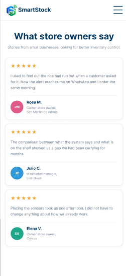
> </p>
> 
> > *Nota.* Mockup de la interfaz de testimonios de SmartStock adaptada para dispositivos móviles.
> 
> **Figura 48. Interfaz de preguntas frecuentes de SmartStock en versión móvil.**
> 
> <p align="center">
>   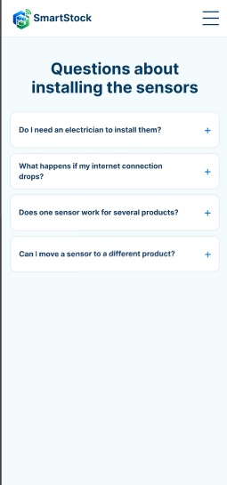
> </p>
> 
> > *Nota.* Mockup de la interfaz de preguntas frecuentes de SmartStock adaptada para dispositivos móviles.
> 
> **Figura 49. Interfaz del formulario de demostración de SmartStock en versión móvil.**
> 
> <p align="center">
>   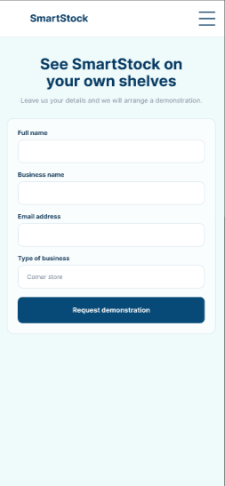
> </p>
> 
> > *Nota.* Mockup de la interfaz del formulario de demostración de SmartStock adaptada para dispositivos móviles.
> 
> **Figura 50. Interfaz del menú de navegación de SmartStock en versión móvil.**
> 
> <p align="center">
>   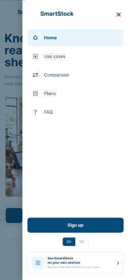
> </p>
> 
> > *Nota.* Mockup del menú de navegación del landing page de SmartStock adaptado para dispositivos móviles.
