# Capítulo V: Product Implementation, Validation & Deployment

En este capítulo se explica y evidencia el proceso de implementar, comprobar, desplegar y validar la solución de SmartStock, compuesta por el Landing Page, los RESTful Web Services y la Frontend Web Application, todos ellos con diseño web responsive. El Landing Page presenta el modelo de negocio y da acceso a la aplicación web. Los procesos del negocio digital, tanto los procesos core como los de soporte (autenticación y autorización, suscripciones, entre otros), están soportados por la Frontend Web Application y los RESTful Web Services.

## 5.1. Software Configuration Management

En esta sección se establecen las decisiones y convenciones que permiten mantener la consistencia del producto durante todo su ciclo de vida, abarcando la configuración del ambiente de desarrollo, la gestión del código fuente, las convenciones de estilo de código y la configuración del despliegue.

### 5.1.1. Software Development Environment Configuration

A continuación se detallan los productos de software que utilizan los miembros del equipo para colaborar en el ciclo de vida del producto digital, agrupados por tipo de actividad, indicando el propósito de uso en el proyecto y la ruta de referencia o de descarga según corresponda.

**Project Management**

| Producto | Propósito de uso en el proyecto | Ruta |
|---|---|---|
| Trello | Gestión del Product Backlog y de los Sprint Backlogs mediante tableros por sprint, con el registro de los work-items y su estado. | https://trello.com |
| Microsoft Teams | Realización de las sesiones síncronas del equipo, incluyendo Sprint Planning, Sprint Review y Retrospective. | https://www.microsoft.com/microsoft-teams |

**Requirements Management**

| Producto | Propósito de uso en el proyecto | Ruta |
|---|---|---|
| UXPressia | Elaboración de los User Personas, Empathy Maps, User Journey Maps e Impact Maps de los segmentos objetivo. | https://uxpressia.com |
| Miro | Realización de las sesiones de Big Picture Event Storming y Design-Level Event Storming. | https://miro.com |

**Product UX/UI Design**

| Producto | Propósito de uso en el proyecto | Ruta |
|---|---|---|
| Figma | Elaboración de los wireframes, mock-ups y prototipos del Landing Page y de la Web Application, en sus versiones para Desktop y Mobile Web Browser. | https://www.figma.com |
| FigJam | Elaboración de los Wireflow Diagrams y de los User Flow Diagrams de la Web Application. | https://www.figma.com/figjam |
| LucidChart | Elaboración de los Class Diagrams de UML y de los Database Diagrams de cada bounded context. | https://www.lucidchart.com |
| Structurizr | Elaboración de los diagramas de C4 Model en sus niveles de Context, Container y Component. | https://structurizr.com |

**Software Development**

| Producto | Propósito de uso en el proyecto | Ruta |
|---|---|---|
| IntelliJ IDEA Ultimate | Entorno de desarrollo integrado para la implementación de los Web Services en Java con Spring Boot. Disponible mediante la JetBrains Educational License. | https://www.jetbrains.com/idea/download |
| WebStorm | Entorno de desarrollo integrado para la implementación de la Frontend Web Application en Angular y del Landing Page. Disponible mediante la JetBrains Educational License. | https://www.jetbrains.com/webstorm/download |
| Java Development Kit (JDK) 21 LTS | Kit de desarrollo del lenguaje Java utilizado para la implementación de los Web Services. | https://adoptium.net/temurin/releases |
| Spring Boot | Framework open source utilizado para la implementación del RESTful API, junto con Spring Data JPA para la persistencia. | https://start.spring.io |
| Node.js y npm | Entorno de ejecución y gestor de paquetes requeridos por Angular CLI. | https://nodejs.org/en/download |
| Angular CLI | Herramienta de línea de comandos para la creación, ejecución y construcción de la Frontend Web Application. | https://angular.dev/tools/cli |
| Angular Material | Biblioteca de componentes de interfaz de usuario basada en Material Design, utilizada en la Web Application. | https://material.angular.io |
| MySQL Community Server | Sistema de gestión de base de datos relacional utilizado para la persistencia de los Web Services. | https://dev.mysql.com/downloads/mysql |
| Postman | Verificación manual de las solicitudes y respuestas de los endpoints del RESTful API durante el desarrollo. | https://www.postman.com/downloads |

**Software Documentation**

| Producto | Propósito de uso en el proyecto | Ruta |
|---|---|---|
| Swagger UI (springdoc-openapi) | Generación y publicación de la documentación del RESTful API bajo la especificación OpenAPI. | https://springdoc.org |
| GitHub | Alojamiento del informe del proyecto en formato Markdown y de la documentación de cada repositorio. | https://github.com/NexoStock |

**Software Deployment**

| Producto | Propósito de uso en el proyecto | Ruta |
|---|---|---|
| GitHub Pages | Publicación del sitio web estático correspondiente al Landing Page. | https://pages.github.com |
| Git | Sistema de control de versiones utilizado localmente por cada miembro del equipo. | https://git-scm.com/downloads |

Pendiente: confirmar el proveedor de despliegue de la Frontend Web Application y de los Web Services antes de la entrega en la que cada producto debe estar desplegado, y agregarlo a este cuadro.

### 5.1.2. Source Code Management

El equipo utiliza GitHub como plataforma de alojamiento y Git como sistema de control de versiones. Los repositorios del proyecto pertenecen a la organización pública InventiaStock y se organizan en un repositorio por producto, además del repositorio de documentación del informe.

| Producto | Repositorio |
|---|---|
| Project Report | https://github.com/InventiaStock/smartstock-docs.git |
| Landing Page | https://github.com/InventiaStock/smartstock-landing-page.git |
| Frontend Web Application | Pendiente de creación. |
| Web Services | Pendiente de creación. |

**GitFlow como workflow de control de versiones**

El equipo aplica GitFlow, siguiendo el modelo de ramificación descrito por Vincent Driessen. Cada repositorio mantiene las siguientes ramas:

| Rama | Propósito | Convención de nombre |
|---|---|---|
| main | Rama principal. Contiene únicamente las versiones entregadas y estables del producto. Cada integración a esta rama corresponde a un release etiquetado. | main |
| develop | Rama de integración. Concentra el avance acumulado de las features completadas que aún no forman parte de un release. | develop |
| Feature branches | Una rama por cada feature o sección en desarrollo. Nace de develop y se integra a develop mediante Pull Request. | feature/\<nombre-en-kebab-case\>, por ejemplo feature/user-stories o feature/sensor-linking |
| Release branches | Rama de preparación de una versión a entregar. Nace de develop y se integra tanto a main como a develop. | release/\<major\>.\<minor\>.\<patch\>, por ejemplo release/1.0.0 |
| Hotfix branches | Rama de corrección urgente sobre una versión ya publicada. Nace de main y se integra tanto a main como a develop. | hotfix/\<nombre-en-kebab-case\>, por ejemplo hotfix/broken-toc-links |

**Semantic Versioning**

Los releases se nombran aplicando Semantic Versioning 2.0.0, bajo el formato MAJOR.MINOR.PATCH. Se incrementa la versión MAJOR ante cambios incompatibles con versiones previas, la versión MINOR ante la incorporación de funcionalidad compatible con versiones previas, y la versión PATCH ante correcciones compatibles con versiones previas. Cada release se registra como un tag de Git sobre main, bajo el formato vMAJOR.MINOR.PATCH.

**Conventional Commits**

Los mensajes de commit siguen la especificación de Conventional Commits, bajo la estructura `<type>(<scope>): <description>`. Los tipos utilizados por el equipo son los siguientes:

| Tipo | Uso |
|---|---|
| feat | Incorporación de una nueva funcionalidad al producto o de una nueva sección al informe. |
| fix | Corrección de un defecto en el producto o de un error en el informe. |
| docs | Cambios que afectan únicamente a la documentación. |
| style | Cambios que no alteran el significado del código, como formato o espaciado. |
| refactor | Cambios en el código que no corrigen defectos ni agregan funcionalidad. |
| test | Incorporación o corrección de pruebas. |
| chore | Cambios en la configuración del proyecto o en las herramientas de soporte. |

La descripción se redacta en inglés, en modo imperativo y en minúsculas, sin punto final. El scope identifica la sección del informe o el módulo del producto afectado.

### 5.1.3. Source Code Style Guide & Conventions

El equipo adopta la nomenclatura en inglés para todos los lenguajes utilizados en la solución, así como las siguientes convenciones estándar de codificación:

| Lenguaje | Convención adoptada |
|---|---|
| HTML | HTML Style Guide and Coding Conventions (W3Schools) / Google HTML/CSS Style Guide |
| CSS | Google HTML/CSS Style Guide |
| JavaScript | Google JavaScript Style Guide / MDN JavaScript Guidelines / Vue Style Guide |
| C# | C# Coding Conventions (Microsoft) / Microsoft ASP.NET Core Coding Guidelines |
| Gherkin (criterios de aceptación) | Gherkin Conventions for Readable Specifications |

### 5.1.4. Software Deployment Configuration

**Landing Page**

El Landing Page se publica como sitio web estático en GitHub Pages, a partir del repositorio correspondiente de la organización InventiaStock. Los pasos de configuración fueron los siguientes:

1. Se integró a la rama main del repositorio del Landing Page la versión a publicar, mediante el flujo GitFlow (ramas feature/, fix/ y chore/ integradas a develop, y develop integrada a main).
2. En la configuración del repositorio, se accedió a la sección **Settings → Pages** y se seleccionó como fuente la rama main y el directorio raíz (/root).
3. Se confirmó la publicación y se verificó el sitio en la URL asignada por GitHub Pages: **https://inventiastock.github.io/smartstock-landing-page/**
4. Se verificó el correcto funcionamiento del selector de idioma, la navegación por anclas y el enlace a los términos y condiciones del footer.

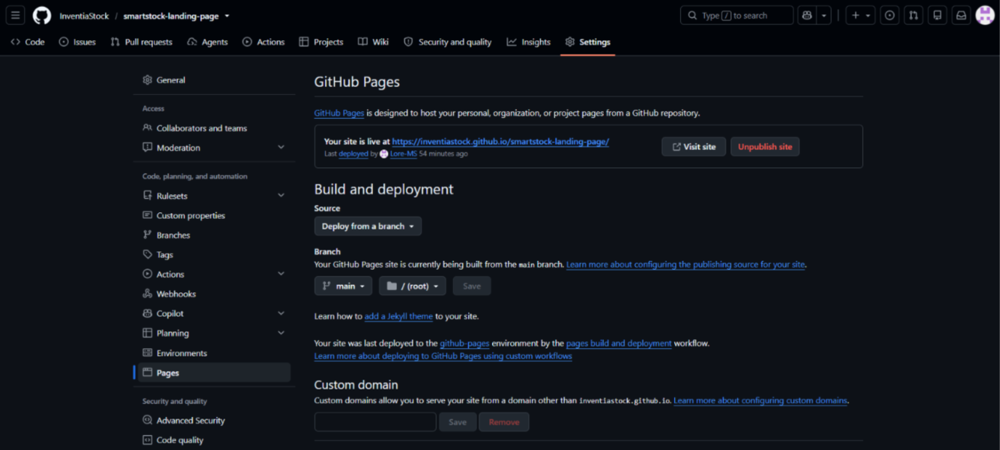
*Nota: Configuración de GitHub Pages para el repositorio smartstock-landing-page, publicando desde la rama main.*

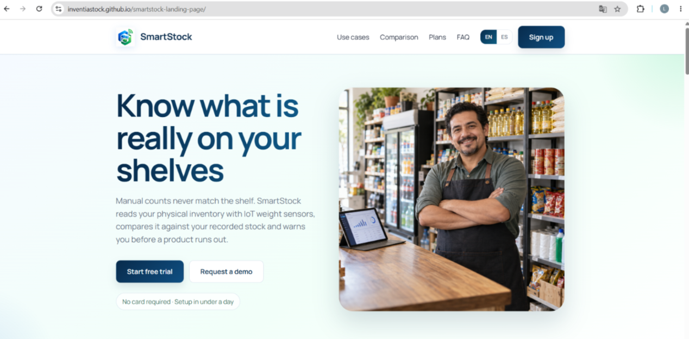
*Nota: Landing page de SmartStock desplegada y accesible públicamente en GitHub Pages.*

## 5.2. Landing Page, Services & Applications Implementation

En esta sección se explica y evidencia el proceso de implementación, pruebas, documentación y despliegue del Landing Page, los Web Services y la Frontend Web Application, organizado por sprints.

### 5.2.1. Sprint 1

#### 5.2.1.1. Sprint Planning 1

| Campo | Detalle |
|---|---|
| Sprint # | 1 |
| Date | 2026-09-12 |
| Time | 4:00 PM |
| Location | Reunión virtual |
| Prepared By | Montañez Salinas, Lorena Ariana |
| Attendees | Lopez Rimachi, Sebastian Leonardo; Montañez Salinas, Lorena Ariana; Sanchez Osorio, Ruth Yanira; Suarez Chinga, Geraldine; Vizcarra Mamani, Candy Milagros |
| Sprint 0 – Review Summary | N/A (Primer Sprint del proyecto. Se establecieron las bases de la arquitectura, infraestructura en la nube y repositorios). |
| Sprint 0 – Retrospective Summary | N/A (Primer Sprint. El equipo acordó usar GitFlow y Conventional Commits rigurosamente desde el primer día). |
| Sprint 1 Goal | Our focus is on delivering a fast, static Landing Page (HTML/CSS/JS) with language support to attract clients and validate our value proposition. We believe it delivers a clear, accessible introduction to our product's value proposition to minimarket and bodega owners exploring inventory solutions. This will be confirmed when the Landing Page is deployed and fully navigable by users, in both supported languages. |
| Sprint 1 Velocity | 10 Story Points (Velocidad estimada para el primer ciclo del equipo). |
| Sum of Story Points | 10 |

#### 5.2.1.2. Aspect Leaders and Collaborators

A continuación, se presenta la matriz de liderazgo y colaboración (LACX), cuyo objetivo es facilitar una comunicación clara y organizada entre los integrantes del equipo durante el desarrollo de las tareas correspondientes a este Sprint.

| Team Member | GitHub Username | Landing Page Structure | Landing Page UI/UX |
|---|---|---|---|
| Lopez Rimachi, Sebastian Leonardo | @leonardoXd1323 | C | C |
| Montañez Salinas, Lorena Ariana | @Lore-MS | C | C |
| Sanchez Osorio, Ruth Yanira | @Yiya-ciber | L | C |
| Suarez Chinga, Geraldine | @geral07-UNIV | C | L |
| Vizcarra Mamani, Candy Milagros | @candyvizz | C | C |

#### 5.2.1.3. Sprint Backlog 1

El Sprint Backlog 1 se estructuró en torno a la construcción del sitio web estático (Landing Page) de SmartStock, encargado de comunicar la propuesta de valor del producto, los casos de uso diferenciados para bodegas de barrio y minimarkets, los planes y precios, la comparación frente a otras soluciones del mercado, y el flujo de contacto y registro de nuevos usuarios. Cada User Story del Epic EP08 se descompuso en tareas técnicas concretas, asignadas a los integrantes del subequipo de Landing Page (Ruth Sánchez y Geraldine Suárez) según su rol de diseño y desarrollo dentro del proyecto.

Trello link: https://trello.com/invite/b/6aa988a0941a5fb8c814af43/ATTI5eecabb28fdc9c85d7ba8336b688a97353B8B08C/trello-web

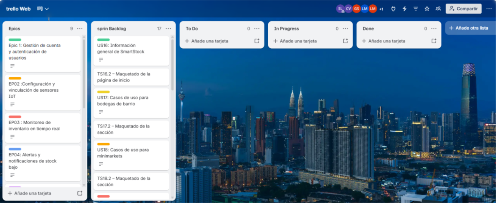

**Sprint # Sprint 1**

| Story Id | Story Title | Task Id | Task Title | Task Description | Estimation (Hours) | Assigned To | Status |
|---|---|---|---|---|---|---|---|
| US16 | Información general de SmartStock | T01 | Construir sección Hero con información general | Maquetar la propuesta de valor y el problema que resuelve SmartStock en la página de inicio, incluyendo los estilos base del sitio (colores y tipografía). | 5 | Ruth Sanchez Osorio | Done |
| US16 | Información general de SmartStock | T02 | Rediseñar la sección Hero | Reestructurar el Hero en dos columnas (copy + imagen), agregar el kicker y la imagen del dueño de tienda, junto con los CTA "Start free trial" y "Request a demo". | 4 | Lorena Montañez Salinas | Done |
| US17 | Casos de uso para bodegas de barrio | T03 | Construir sección de casos de uso — bodegas | Maquetar el contenido dirigido al segmento bodegas de barrio. | 3 | Ruth Sanchez Osorio | Done |
| US17 | Casos de uso para bodegas de barrio | T04 | Refinar el copy de casos de uso — bodegas | Ajustar la redacción del contenido de bodegas para mayor claridad. | 1 | Lorena Montañez Salinas | Done |
| US18 | Casos de uso para minimarkets | T05 | Construir sección de casos de uso — minimarkets | Maquetar el contenido dirigido al segmento minimarkets. | 3 | Ruth Sanchez Osorio | Done |
| US18 | Casos de uso para minimarkets | T06 | Refinar el copy de casos de uso — minimarkets | Ajustar la redacción del contenido de minimarkets para mayor claridad. | 1 | Lorena Montañez Salinas | Done |
| US19 | Planes y precios | T07 | Construir sección de planes y precios | Maquetar los planes disponibles con sus características y costos. | 3 | Ruth Sanchez Osorio | Done |
| US19 | Planes y precios | T08 | Agregar botones de selección de plan | Implementar los CTA "Choose Starter" y "Choose Growth" en la sección de planes. | 2 | Candy Vizcarra Mamani | Done |
| US20 | Formulario de contacto para solicitar demostración | T09 | Construir formulario de contacto y validación | Maquetar el formulario (nombre, negocio, correo) e implementar la validación de campos obligatorios. | 4 | Ruth Sanchez Osorio | Done |
| US21 | Preguntas frecuentes sobre instalación de sensores | T10 | Construir sección de preguntas frecuentes | Maquetar el listado de preguntas y respuestas sobre instalación de sensores IoT. | 2 | Ruth Sanchez Osorio | Done |
| US22 | Testimonios de dueños de bodega | T11 | Construir sección de testimonios (base) | Maquetar la sección inicial de testimonios de clientes. | 2 | Ruth Sanchez Osorio | Done |
| US22 | Testimonios de dueños de bodega | T12 | Rediseñar testimonios como grid de tarjetas | Reestructurar la sección en un grid de tarjetas, con avatares, calificación de 5 estrellas y el rol de cada persona. | 4 | Geraldine Suarez Chinga | Done |
| US22 | Testimonios de dueños de bodega | T13 | Estilizar el nuevo grid de testimonios | Agregar los estilos CSS del nuevo diseño de testimonios. | 2 | Geraldine Suarez Chinga | Done |
| US23 | Comparación frente a otras soluciones | T14 | Construir tabla comparativa | Maquetar la tabla comparativa entre SmartStock y otras soluciones del mercado. | 3 | Ruth Sanchez Osorio | Done |
| US24 | Acceso a registro desde el sitio web | T15 | Agregar acceso a registro permanente en el header | Incorporar el enlace de registro visible desde cualquier sección del sitio. | 2 | Ruth Sanchez Osorio | Done |
| US24 | Acceso a registro desde el sitio web | T16 | Ajustar logo y etiquetas aria del navbar | Redimensionar el logo (28px→42px) y añadir etiquetas aria descriptivas en la navegación. | 2 | Candy Vizcarra Mamani | Done |
| US24 | Acceso a registro desde el sitio web | T17 | Dar visibilidad persistente al enlace de registro | Incorporar el enlace "Sign up" visible de forma persistente en el header. | 2 | Candy Vizcarra Mamani | Done |
| US24 | Acceso a registro desde el sitio web | T18 | Reparar navegación en pantallas angostas | Corregir el comportamiento del menú y el acceso al registro en viewports menores a 720px. | 3 | Sebastian Lopez Rimachi | Done |
| — | Tarea adicional (no ligada a un User Story en particular) | T19 | Implementar selector de idioma (inglés/español) | Añadir el switch de idioma con inglés por defecto y diccionario para español (es_419), aplicado a todas las secciones. | 4 | Ruth Sanchez Osorio | Done |
| — | Tarea adicional (no ligada a un User Story en particular) | T20 | Redactar términos y condiciones | Elaborar la página de términos y condiciones enlazada desde el footer, siguiendo el código de ética ACM/IEEE y del Colegio de Ingenieros del Perú. | 3 | Ruth Sanchez Osorio | Done |
| — | Tarea adicional (no ligada a un User Story en particular) | T21 | Eliminar rutas hardcodeadas del script | Quitar la URL y las rutas de la app hardcodeadas en script.js. | 2 | Sebastian Lopez Rimachi | Done |
| — | Tarea adicional (no ligada a un User Story en particular) | T22 | Forzar idioma por defecto (inglés) | Configurar inglés como locale por defecto según requisito del curso. | 1 | Sebastian Lopez Rimachi | Done |
| — | Tarea adicional (no ligada a un User Story en particular) | T23 | Documentar el proyecto (README) | Redactar el README con el propósito del proyecto, el stack utilizado y la estructura de archivos. | 2 | Lorena Montañez Salinas | Done |

**Resumen de carga por integrante:** Ruth Sanchez Osorio (11 tasks, 34h) · Lorena Montañez Salinas (4 tasks, 8h) · Candy Vizcarra Mamani (3 tasks, 6h) · Geraldine Suarez Chinga (2 tasks, 6h) · Sebastian Lopez Rimachi (3 tasks, 6h).

#### 5.2.1.4. Development Evidence for Sprint Review

Durante el Sprint 1 se implementó la primera versión del sitio web estático (Landing Page) de SmartStock, cubriendo las secciones de propuesta de valor, problemática, casos de uso por segmento, comparación frente a otras soluciones, planes y precios, testimonios, preguntas frecuentes y formulario de contacto. A continuación se presenta la tabla de commits relacionados con la implementación, organizados por rama según GitFlow y redactados bajo la convención de Conventional Commits.

| Repository | Branch | Commit Id | Commit Message | Commit Message Body | Commited on (Date) |
|---|---|---|---|---|---|
| smartstock-landing-page | feature/landing-page | 8f8baff | feat(landing): add base styles | White as the dominant background, navy for headings and actions. Only the tokens the page actually uses are declared. | 10/09/2026 |
| smartstock-landing-page | feature/landing-page | 083b61e | feat(landing): add the home page sections | Cover the user stories of the static web site: general information and the problem it solves (US16), use cases for corner stores (US17) and minimarkets (US18), comparison against other solutions (US23), plans and pricing (US19), testimonials (US22), sensor installation FAQ (US21), demonstration request form (US20) and permanent access to sign-up from the header (US24). | 10/09/2026 |
| smartstock-landing-page | feature/landing-page | a3d57f5 | feat(landing): add language switch, menu, faq and form validation | English is the default language and its copy lives in the markup, so the page still reads complete if this script fails to load. Spanish (es_419) comes from a flat dictionary. The call-to-action links to the web application are built from a single URL constant. | 11/09/2026 |
| smartstock-landing-page | feature/landing-page | f1fd4da | feat(landing): add terms and conditions linked from the footer | Written following the ACM/IEEE Software Engineering Code of Ethics and the code of ethics of the Colegio de Ingenieros del Perú. | 11/09/2026 |
| smartstock-landing-page | fix/mobile-navbar | 519a06f | fix(landing): repair the navigation bar on narrow screens | Below 720px the sign-up button moves into the collapsible menu so the bar keeps only the brand, language switch and menu button. Sign-up stays reachable from every section (US24) and the language switch stays visible. | 12/09/2026 |
| smartstock-landing-page | feature/header-navbar | 5dcbdb0 | feat(landing): resize brand logo and improve navbar aria labels | Se ajustó el tamaño del logo (28px→42px) y se añadieron etiquetas aria descriptivas en el selector de idioma y la navegación. Aplica en index.html y terms-of-service.html. | 12/09/2026 |
| smartstock-landing-page | feature/header-navbar | e08146f | feat(landing): add persistent sign up link in header | Se agregó el enlace "Sign up" visible en el header. | 13/09/2026 |
| smartstock-landing-page | feature/pricing-cta | 4496ea1 | feat(landing): add plan selection CTA buttons | Se agregaron los botones "Choose Starter" y "Choose Growth" en la sección de planes. | 13/09/2026 |
| smartstock-landing-page | feature/usecase-content | bc2072c | content: refine corner store and minimarket copy | Se ajustó la redacción de los casos de uso de bodega y minimarket. | 14/09/2026 |
| smartstock-landing-page | feature/hero-redesign | 9a8b222 | feat(landing): redesign hero section with visual and kicker | Se reestructuró el hero en dos columnas (copy + imagen), añadiendo el kicker y la imagen del dueño de tienda. | 14/09/2026 |
| smartstock-landing-page | feature/hero-redesign | ec752f4 | feat(landing): add hero CTAs and supporting copy | Se agregaron los botones "Start free trial" y "Request a demo" junto con el texto de nota. | 15/09/2026 |
| smartstock-landing-page | feature/testimonials-redesign | 3ceb77f | feat(landing): rebuild testimonials as card grid | Se reestructuró la sección de testimonios en un grid de tarjetas. | 15/09/2026 |
| smartstock-landing-page | feature/testimonials-redesign | 21f1118 | feat(landing): add avatars, ratings and roles to testimonials | Se añadieron avatares, calificación de 5 estrellas y el rol de cada persona. | 16/09/2026 |
| smartstock-landing-page | feature/testimonials-redesign | aed1e38 | style(landing): add testimonials grid and card styles | Se agregaron los estilos CSS del nuevo diseño de testimonios. | 16/09/2026 |
| smartstock-landing-page | chore/script-cleanup | 871c162 | chore(landing): remove hardcoded app routes from script | Se eliminaron la URL y las rutas de la app hardcodeadas en script.js. | 16/09/2026 |
| smartstock-landing-page | chore/script-cleanup | eb3dc3c | fix(landing): set English as default locale | Se forzó inglés como idioma por defecto según requisito del curso. | 16/09/2026 |
| smartstock-landing-page | develop | bb44d80 | docs: add project README | Se documenta el propósito del proyecto, el stack utilizado y la estructura de archivos del landing page. | 16/09/2026 |

#### 5.2.1.5. Execution Evidence for Sprint Review

Durante el Sprint 1 se implementó y desplegó la primera versión del Landing Page, que cubre las User Stories del sitio web estático especificadas en la sección 3.1. El sitio se encuentra accesible en https://inventiastock.github.io/smartstock-landing-page/.

A continuación se presentan las principales vistas implementadas.

**Encabezado principal y propuesta de valor (US16, US24)**

El encabezado principal se organiza en dos columnas: a la izquierda la propuesta de valor, que presenta qué es SmartStock y qué problema resuelve, y a la derecha una fotografía de un propietario de tienda utilizando la plataforma junto a sus estantes abastecidos. La imagen permite que el visitante reconozca el segmento al que se dirige el producto antes de leer una sola línea, y cuenta con un texto alternativo descriptivo que se traduce junto con el resto de la página.

La barra superior mantiene visibles de forma permanente el selector de idioma y la acción de crear cuenta, en cumplimiento de la regla de negocio de la US24.

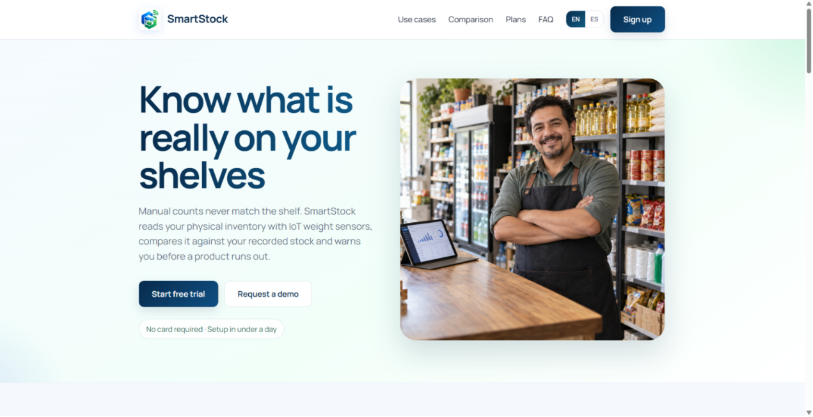

**Casos de uso por segmento objetivo (US17, US18)**

La sección de casos de uso separa el contenido dirigido a bodegas de barrio del dirigido a minimarkets. Cada bloque enumera los beneficios propios del segmento y cierra con un call-to-action que redirige a la vista de registro de la Web Application transportando el segmento correspondiente. La captura se presenta con la experiencia conmutada a español latinoamericano, de modo que evidencie además el alcance de la traducción sobre el contenido de esta sección.

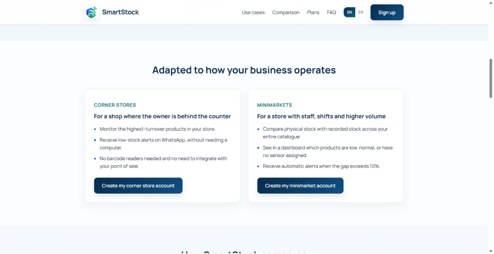

**Planes y precios (US19)**

Los tres planes se presentan sobre el mismo conjunto de características, ordenados de menor a mayor capacidad, y el plan intermedio se destaca mediante un borde de mayor peso. Cada plan conduce al registro con el plan preseleccionado. Las tarjetas aplican el refresco visual del design system: radio de esquina de 14 píxeles, elevación tenue en reposo y un filete de acento que se revela al pasar el cursor.

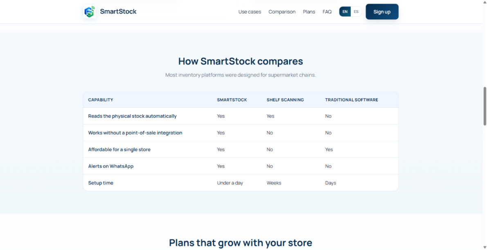

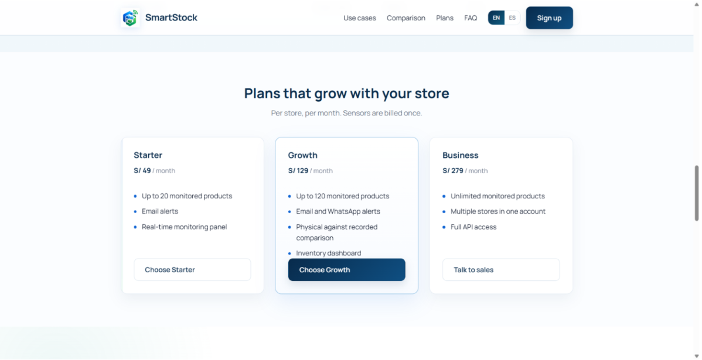

**Testimonios de clientes (US22)**

La sección de testimonios presenta las opiniones recogidas durante las entrevistas, cada una acompañada de una valoración y de un avatar con las iniciales del entrevistado. La valoración se expone además mediante aria-label, de modo que un lector de pantalla anuncie la calificación en lugar de leer una sucesión de símbolos.

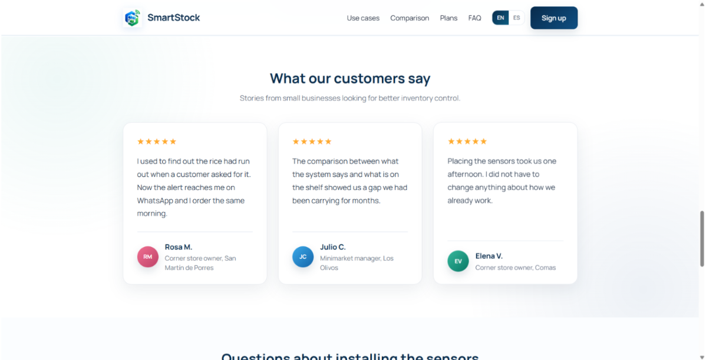

**Formulario de solicitud de demostración (US20)**

El formulario valida los campos obligatorios al abandonar cada campo y expone los mensajes de error mediante `role="alert"`, de modo que un lector de pantalla los anuncie. Los campos adoptan el radio de esquina y el color de borde definidos en la sección 4.1, y el botón de envío emplea el degradado de marca.

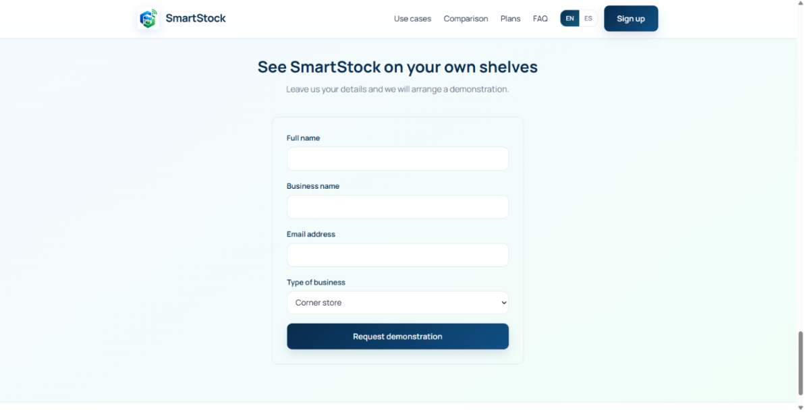

**Internacionalización de la experiencia (en_US / es_419)**

El idioma por defecto del sitio es el inglés, conforme a lo establecido en el enunciado. El sitio no adopta el idioma del navegador en la primera visita, precisamente para que el idioma por defecto del producto sea siempre el inglés; a partir de ahí, la preferencia elegida por el visitante queda registrada en el navegador.

El selector de idioma de la barra superior conmuta toda la experiencia al español latinoamericano, incluyendo el título del documento, los textos de la interfaz, los mensajes de validación del formulario y los atributos aria-label de la navegación, del selector de idioma y de la imagen del encabezado principal. El atributo `lang` del documento se actualiza en cada conmutación, de modo que un lector de pantalla emplee la pronunciación correcta.

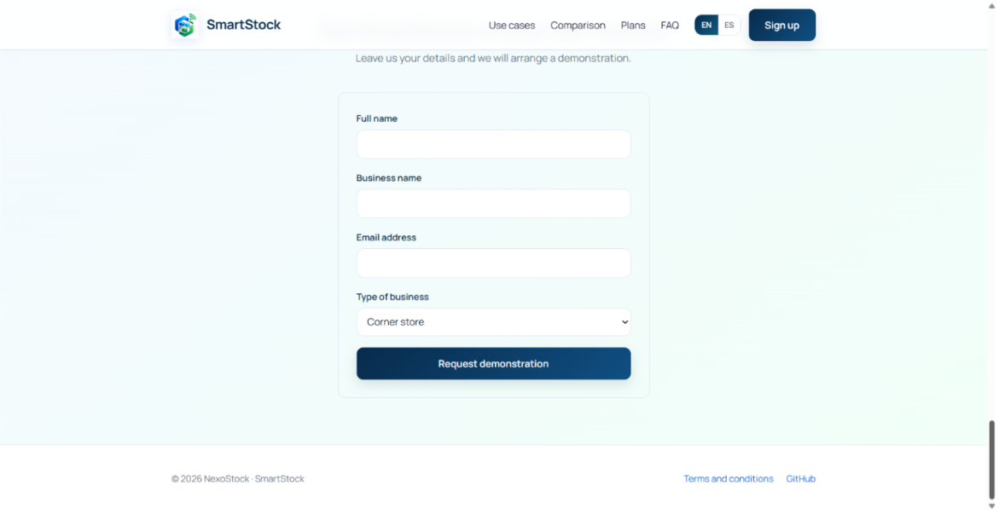

**Diseño web adaptable (responsive web design)**

La experiencia se adapta a las dimensiones del dispositivo cliente. En navegador móvil, las rejillas de tarjetas colapsan a una sola columna, la escala tipográfica de los titulares se reduce y la navegación se repliega tras un botón de menú.

La barra superior conserva en pantallas estrechas únicamente la marca, el selector de idioma y el botón de menú. La acción de crear cuenta se traslada al interior del menú desplegable, de modo que la barra no compita por el ancho disponible y se mantenga el cumplimiento de la regla de negocio de la US24, que establece que la opción de registro está disponible de forma permanente en todas las secciones del sitio web estático.

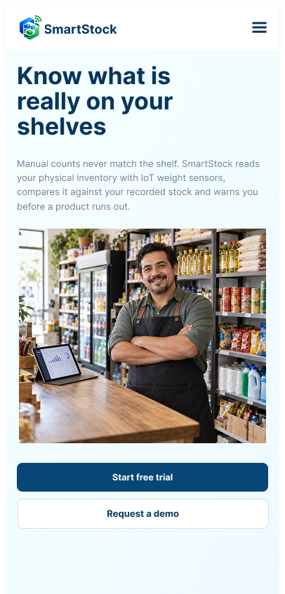
*Nota: Mockup de la interfaz principal de inicio del landing page de SmartStock adaptada para dispositivos móviles.*

**Landing Page Demonstration Video:** SmartStock - Landing Page Review.mp4
<!-- PENDIENTE: reemplazar por el enlace real de alojamiento del video (Microsoft Stream/YouTube/Drive) una vez esté publicado. -->

#### 5.2.1.6. Services Documentation Evidence for Sprint Review

N/A. Durante el Sprint 1 el esfuerzo de desarrollo se enfocó exclusivamente en la creación del sitio web estático promocional (Landing Page), por lo que aún no se han implementado APIs RESTful ni Endpoints backend que requieran ser documentados a través de Swagger/OpenAPI. Esta documentación se estructurará a partir del Sprint 2.

#### 5.2.1.7. Software Deployment Evidence for Sprint Review

Durante el Sprint 1, el alcance de despliegue correspondió al Landing Page. El equipo creó el repositorio `smartstock-landing-page` dentro de la organización InventiaStock, aplicó sobre él el flujo de trabajo GitFlow e integró la versión 1.0.0 a la rama `main` mediante una release branch. A continuación, habilitó GitHub Pages tomando como fuente dicha rama y el directorio raíz del repositorio.

| Producto | Repositorio | URL desplegado | Estado |
|---|---|---|---|
| Landing Page | https://github.com/InventiaStock/smartstock-landing-page | https://inventiastock.github.io/smartstock-landing-page/ | Desplegado |
| Frontend Web Application | Pendiente de despliegue. | — | Fuera del alcance del Sprint 1 |
| Web Services | Pendiente de despliegue. | — | Fuera del alcance del Sprint 1 |

La configuración aplicada en el repositorio se muestra a continuación. La fuente de publicación es la rama main y el directorio raíz, y GitHub confirma la publicación del sitio. En el selector de ramas se aprecian además las ramas main y develop, que evidencian la aplicación de GitFlow sobre el repositorio.

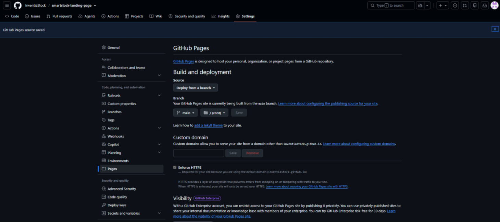
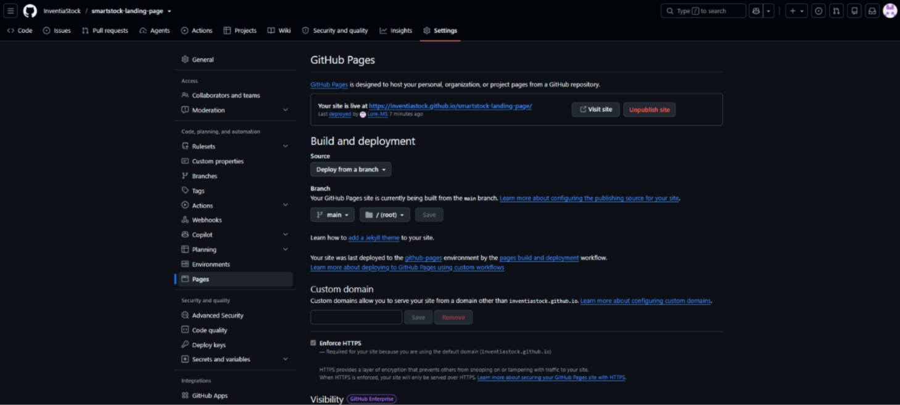

Se verificó que el sitio publicado responde correctamente tanto en la página de inicio como en la página de términos y condiciones, y que la hoja de estilos y el archivo de comportamiento se sirven sin errores.

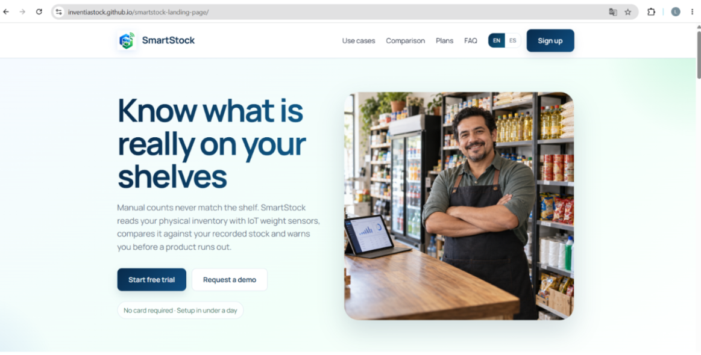

#### 5.2.1.8. Team Collaboration Insights during Sprint

Durante el Sprint 1, el equipo organizó la implementación del Landing Page según los aspectos definidos en la sección 5.2.1.2. Cada integrante trabajó sobre el aspecto que lideraba y registró su aporte mediante commits propios en el repositorio smartstock-landing-page, aplicando GitFlow y Conventional Commits.

El flujo de trabajo seguido fue el siguiente: la rama develop concentró el avance acumulado, cada conjunto de cambios se desarrolló en una rama feature/ que se integró a develop sin avance rápido (`--no-ff`), de modo que el historial conserve visible el punto de integración de cada aporte, y la versión entregada se publicó desde main mediante una release branch.

**Analíticos de colaboración del repositorio del Landing Page**

La vista de contribuyentes evidencia la participación de los cinco integrantes del equipo, con el detalle de commits y de líneas agregadas y eliminadas por cada uno.

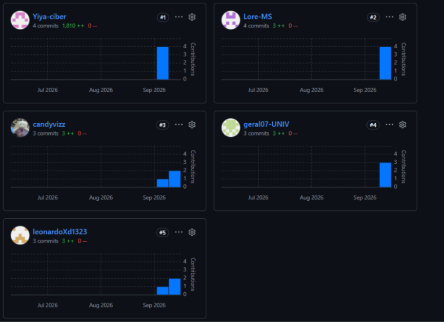
*Nota: Contribuyentes del repositorio smartstock-landing-page, los cinco integrantes del equipo registran commits propios.*

**Historial de ramas del repositorio**

El grafo de red muestra la aplicación efectiva de GitFlow: las ramas de feature nacen de develop, se integran nuevamente a ella y la rama main recibe únicamente las versiones publicadas.
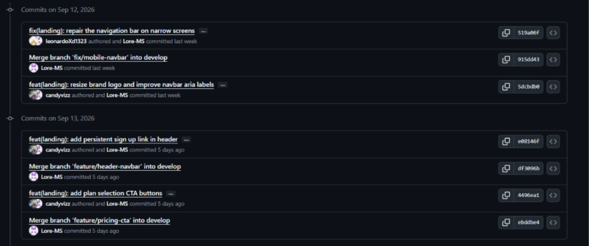
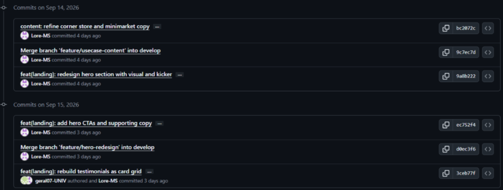
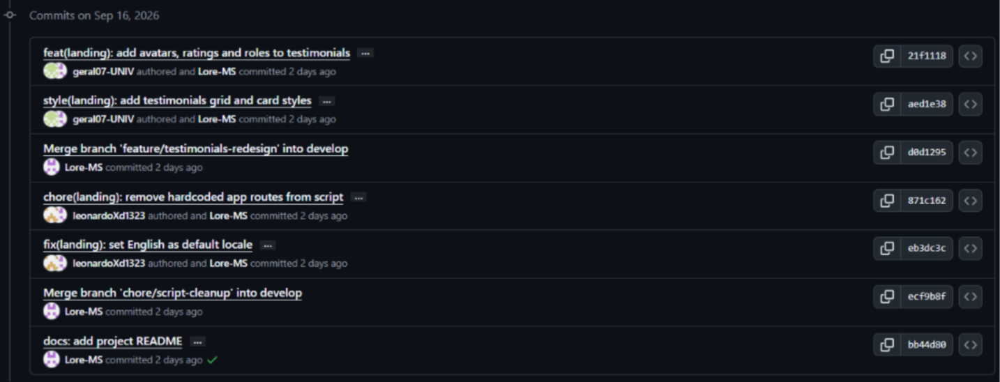

*Nota: Comparación de commits entre la primera rama de trabajo y main, mostrando la autoría real de cada commit (autor original y quien lo integró).*
